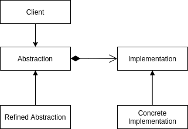

<Reference
entries={[
["桥接模式", "https://refactoringguru.cn/design-patterns/bridge"],
["桥接", "https://www.liaoxuefeng.com/wiki/1252599548343744/1281319266943009"],
["Bridge Pattern vs Dependency Injection", "https://stackoverflow.com/questions/18540645/bridge-pattern-vs-dependency-injection"],
]}
/>

## 概述

**桥接模式** 属于结构型设计模式，可将类中的抽象部分与实现部分分离，使他们能够独立的应对变化。一般用于避免继承带来的类爆炸问题。

- 抽象部分：一些实体的高阶控制层，需要将工作委派给时实现部分层；
- 实现部分：实际工作执行层；

## 例子（TypeScript 实现）

桥接模式的实际例子不多，这里用 refactoringguru 中提到的 Remote 与 Device 写例子。

假设有不同的遥控器 (Remote) 与不同的设备 (Device) ，他们希望被同时扩展，则：将 Remote 视为抽象部分， Device 视为具体部分，Remote 的具体工作由 Device 完成。

```ts
class Remote {
  // 使用组合连接抽象与具体部分
  constructor(public device: Device) {}

  togglePower() {}
}

class AdvancedRemote extends Remote {
  mute() {}
}

class Device {
  constructor(public power: boolean = false) {}

  on() {}
  off() {}
}

class TV extends Device {}
class Radio extends Device {}

const radioRemote = new Remote(new Radio());
const tvRemote = new Remote(new TV());
```

## 结构



- Abstraction (抽象)：抽象部分；
- Implemenatation (具体)：具体部分；
- Refined Abstraction (精确抽象)：提供抽象逻辑变体（可选）；
- Concrete Implemenatation：具体部分的实际实现；

## 优缺点

优点：

- 客户端代码仅与高层抽象交互；
- 开闭原则：可以新增抽象与具体的部分，他们之间不会相互影响；
- 单一职责原则：抽象部分专注于高层逻辑，具体部分处理底层细节；

缺点：

- 对于高内聚的类，使用此模式会比较困难；
