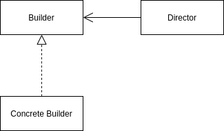

<Reference
entries={[
["生成器模式", "https://refactoringguru.cn/design-patterns/builder"]
]}
/>

## 概述

**生成器模式** 属于创建型模式，允许分步骤创建复杂对象。

## 结构



- Builder (生成器接口): 生成器通用步骤接口；
- Concrete Builder (具体生成器): 含有具体的构建步骤；
- Director (主管): 调用构建步骤以得到生成特定产品的生成器。Director 并不是必需的；

## 例子：SQL Builder

```ts
interface SQLBuilder {
  execute: <T>() => Promise<T>;
}

class QueryBuilder implements SQLBuilder {
  from(table: string): this {
    return this;
  }
  columns(columns: string[]): this {
    return this;
  }
  async execute<T>() {
    return null as any as T;
  }
}

class MutateBuilder implements SQLBuilder {
  from(table: string): this {
    return this;
  }
  delete(): this {
    return this;
  }
  async execute<T>() {
    return null as any as T;
  }
}

async function main() {
  const queryBuilder = new QueryBuilder();

  const result = await queryBuilder
    .from("user")
    .columns(["username", "password"])
    .execute<{ username: string; password: string }>();
}
```

## 优缺点

优点：

- 分步骤创建对象，暂缓/递归创建步骤；
- 复用制造代码；
- 单一职责原则；

缺点：

- 代码整体复杂度提升；

## 应用

### 链式 API 库

许多设计为 fluent API 的库引用了这一模式，如 `Prisma`, `webpack-chain` 等。
