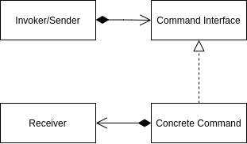

<Reference
entries={[
["命令模式", "https://refactoringguru.cn/design-patterns/command"],
]}
/>

## 概述

**命令模式** 属于行为模式，可将请求转换为包含请求相关信息的独立对象。

## 结构



- Invoker/Sender (触发者/发送者)：负责绑定命令对象与触发命令；
- Command Interface (命令接口)；
- Concrete Command (具体命令)：实现各种请求，但自身并不完成工作，而是将请求发送给 Receiver 完成；
- Receiver (接收者)：接收来自命令对象的请求并完成工作；

## 例子：编辑器

```ts
interface EditorService {}

// Command Interface
abstract class Command {
  constructor(protected editor: EditorService) {}

  abstract execute(): void;
}

// Concrete Commands
class CopyCommand extends Command {
  execute() {
    // -- snip --
  }
}
class PasteCommand extends Command {
  execute() {
    // -- snip --
  }
}

interface Control {
  bindHandler: (handler: () => void) => void;
}

declare const copyButton: Control;
declare const pasteButton: Control;

// Invoker
class Application {
  constructor(private editor: EditorService) {
    copyButton.bindHandler(() => {
      this.executeCommand(new CopyCommand(this.editor));
    });
    pasteButton.bindHandler(() => {
      this.executeCommand(new PasteCommand(this.editor));
    });
  }

  executeCommand(command: Command) {
    command.execute();
  }
}
```

## 优缺点

优点

- 单一职责原则：解耦发送者与接受者；
- 开闭原则：在不修改客户端代码的情况下创建新命令对象；

缺点

- 代码可能变复杂；

## 应用

### Redux

> [【译】Redux 和 命令模式](https://blog.jimmylv.info/2016-04-19-redux-and-the-command-pattern/)

可以认为 Redux 基于命令模式：

- Dispatch: Invoker，创建并调用命令；
- Action: Command，命令对象的数据部分；
- Reducer: Command，命令对象的执行逻辑部分；
- store: Receiver，接收者；
