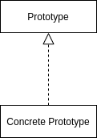

<Reference
entries={[
["原型模式", "https://refactoringguru.cn/design-patterns/prototype"]
]}
/>

## 概述

**原型模式** 属于创造型模式，可以在不知晓类的具体类型的情况下克隆对象。

## 结构



- Prototype (原型接口): 通常只包含一个 `clone` 用于克隆的方法；
- Concrete Prototype (原型)；

## 例子 (TypeScript 实现)

以 refactoringguru 中的 Shape 例子编码实现。

```ts
interface Prototype<T> {
  clone: () => T;
}

abstract class Shape implements Prototype<Shape> {
  protected abstract x: number;
  protected abstract y: number;

  abstract clone(): Shape;
}

class Circle extends Shape {
  constructor(
    protected x: number,
    protected y: number,
    // new property
    protected radius: number
  ) {
    super();
  }

  clone(): Circle {
    return this;
  }
}

class Rectangle extends Shape {
  constructor(
    protected x: number,
    protected y: number,
    // new property
    protected width: number,
    protected height: number
  ) {
    super();
  }

  clone(): Rectangle {
    return new Rectangle(this.x, this.y, this.width, this.height);
  }
}

function handler() {
  const circle1: Circle = new Circle(0, 0, 0);
  const circle2: Circle = circle1.clone();

  const shapes: Shape[] = [circle1, circle2];
  // 由于多态机制（JavaScript 中基于原型链实现多态），可以不用关注类型
  const clonedShapes: Shape[] = shapes.map((shape) => shape.clone());
}
```

## 优缺点

### 优点

- 可以克隆对象，且无需关注实际类型；
- 可以预生成模型，避免反复运行初始化代码；
- 方便生成复杂对象；

## 应用

### JavaScript 基于原型模式实现继承

ES6 的 `class` 是语法糖，本质上使用 `function` + `prototype` 实现，在实现时，会使用原型模式拷贝成员，如 原型式继承 的关键代码如下：

```ts
function createObj(o) {
  function F() {}
  F.prototype = o;
  return new F();
}
```
