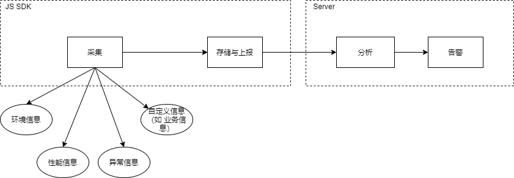

> [一文彻底搞懂前端监控](https://segmentfault.com/a/1190000038393411)  
> [前端监控体系及实现技术详解](https://juejin.cn/post/6936562262480158728)  
> [前端监控和前端埋点方案设计](https://juejin.cn/post/6844903650603565063)  
> [前端埋点总结](https://segmentfault.com/a/1190000037512181)  
> [美团开源 Logan Web：前端日志在 Web 端的实现](https://tech.meituan.com/2020/01/09/meituan-logan.html)  
> [如何优雅地上报前端监控日志](https://juejin.cn/post/6844903697156145165)  
> [前端异常监控解决方案研究](https://cdc.tencent.com/2018/09/13/frontend-exception-monitor-research/)  
> [去大厂，你就应该了解前端监控和埋点!](https://cloud.tencent.com/developer/article/1643099)  

## 前言

**特别提醒，笔者在日常实际业务中接触前端监控较少，没有设计上的实践！！！**  （后续如果有相关设计的需求可能会大改本文）  

写本文有以下的目的：  

1. 理论层面应付面试；  
1. 作为一个引子，了解前端通常需要考虑的各项数据；  

一般而言，**前端监控** 有以下的作用：

1. **异常**：尽早发现功能异常以及时修复；  
1. **性能**：通过页面加载时间相关数据，找出性能瓶颈；  
1. **数据**：通过页面的访问量，停留时间等用户行为进行分析，进而调整产品的相关迭代；  

**前端埋点** 是前端监控最常见的实现方式，埋点信息一部分包括了 **前端日志** 信息（如 错误信息日志）。  

前端监控的整体流程与划分部分如下图：  

  

目前，本文只会涉及 **采集** 与 **存储/上报**。  

## 采集

### 采集信息

> [前端-如何精确统计页面停留时长](https://cloud.tencent.com/developer/article/1408482)  

以下是一个 Demo，包含了下列一部分指标的获取方法。  

<iframe src="https://codesandbox.io/embed/some-frontend-monitor-info-collect-u0nf0?fontsize=14&hidenavigation=1&theme=dark"
  style="width:100%; height:500px; border:0; border-radius: 4px; overflow:hidden;"
  title="some-frontend-monitor-info-collect"
  allow="accelerometer; ambient-light-sensor; camera; encrypted-media; geolocation; gyroscope; hid; microphone; midi; payment; usb; vr; xr-spatial-tracking"
  sandbox="allow-forms allow-modals allow-popups allow-presentation allow-same-origin allow-scripts"
></iframe>

#### 环境信息

- 用户信息：用户 ID  
- 设备信息：User Agent、用户设备、用户操作系统、屏幕宽度高度、网络信息  
- 应用信息：客户端 ID、版本、语言、页面宽度高度  
- 接口信息：API 地址、版本  
- ...

#### 异常信息 / 日志信息

- 日志级别：info / warning / error  
- 异常消息  
- 异常代码位置 (位于第几行、第几列)  
- 调用栈  
- 产生时间   

#### 性能信息

- 页面展示性能信息：FCP, LCP, TTI 等；  
- 网络性能信息：DNS 解析耗时、TCP 连接耗时 等；  
- 运行时性能信息；  

#### 其他信息

- UV / PV 量  
- 页面访问时间  
- 页面停留时间 (Time on Page, TP)  
- 访问来源  

### 采集方式 - 埋点

#### 埋点方式分类

- **代码埋点**：以显式嵌入形式的代码进行埋点，可以在任意时刻精确的抓取与发送需要的信息，但工作量较大；  
- **可视化埋点**：通过可视化埋点系统进行埋点，非研发人员也可以使用系统进行埋点；  
- **无痕埋点**：全部埋点，记录前端的所有事件并上传。这种方法不会出现漏埋、误埋的情况，但需要采集全局数据，对数据传输与服务器造成压力；  

#### 接口埋点

> [sentry-javascript解析（一）fetch如何捕获](https://juejin.cn/post/6929542107514273805)  
> [sentry-javascript解析（二）XHR如何捕获](https://juejin.cn/post/6930133349507792910)  

对于全局方式，可以般通过捕获 `fetch` 与 `xhr` 方式做全局 patch，形如：

- `fetch`: `window.fetch = ...`  
- `xhr`: `XMLHttpRequest.prototype.open = ...`, `XMLHttpRequest.prototype.send = ...`  

在库 / 框架的范畴内，可以通过工具提供的能力做埋点，如：

- 通过 axios 的 `interceptor` 进行拦截；  
- 通过 React 的 `ErrorBoundary`；  

#### JavaScript 异常捕获埋点

在全局捕获下：

- 一般异常：通过监听 `window` 的 `error` 事件实现监听异常；  
- promise 异常：对于没有处理 rejection 的 promise，通过监听 `window` 的 `unhandledrejection` 事件实现监听异常；  

在局部捕获下，实际上与捕获异常的方式相同，如：

- `try { ... } catch { ... }`  
- `promise.catch`  
 
在捕获异常的位置编写埋点方法。  

## 存储 & 上报

### 存储 API

对于采集到的数据，如果所有数据都一采集就上传到服务端，会对前端网络性能、渲染性能与服务端压力造成较大影响，因此需要进行存储，再根据实际需要选择上传的时间与数据量。一般的，存储 API 有：  

- localStorage / sessionStorage: key-value 同步存储字符串，最大容量一般为 4MB；  
- IndexedDB: NoSQL 数据库异步存储对象，最大容量一般为 500 MB；  

### 上报 API

> [前端监控数据上报请求、图片打点和sendBeacon三种方式对比](http://blog.yunishare.cn/2021/01/web-report-methods-compare.html)  
> [为什么前端监控要用GIF打点](https://mp.weixin.qq.com/s/v6R2w26qZkEilXY0mPUBCw)  

存储的信息上报到服务端常见的方式有：  

- AJAX (xhr / fetch)：有跨域问题；  
- 图片请求 (如 `new Image(...)`, ``)：只支持 GET，无跨域问题，且不会阻塞页面加载。一般使用 1x1 的 gif 图片，因为其支持透明，对页面显示影响不大，并且传输体积更小；  
- sendBeacon (`navigator.sendBeacon`): 支持 POST，无跨域问题，不会阻塞页面加载，传输数据大小较大，是一个较新的 API 因此有部分浏览器不支持；  

### 上报方式

根据信息性质的不同，可以采用分别采用以下的上报方式：  

- 立即上报：对于重要且紧急的信息，采用立即上报方式，便于运维尽早发现问题与报警；  
- 批量上报：对存储的信息，定时定量上报；  
- 用户反馈：用户主动反馈 bug；  

