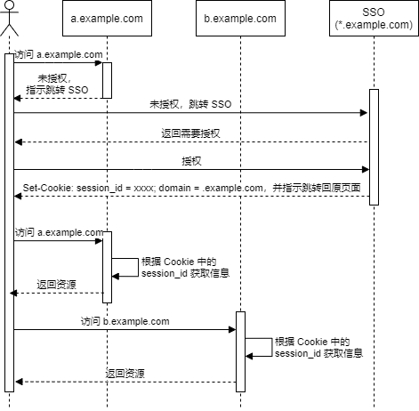
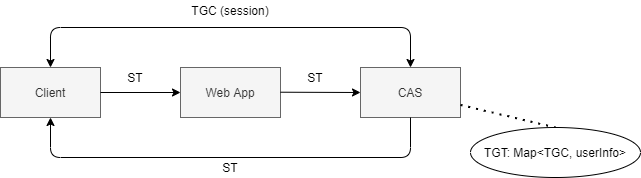
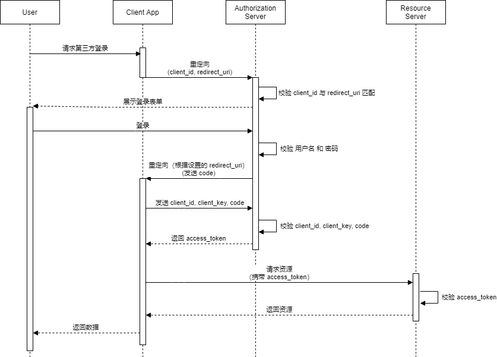
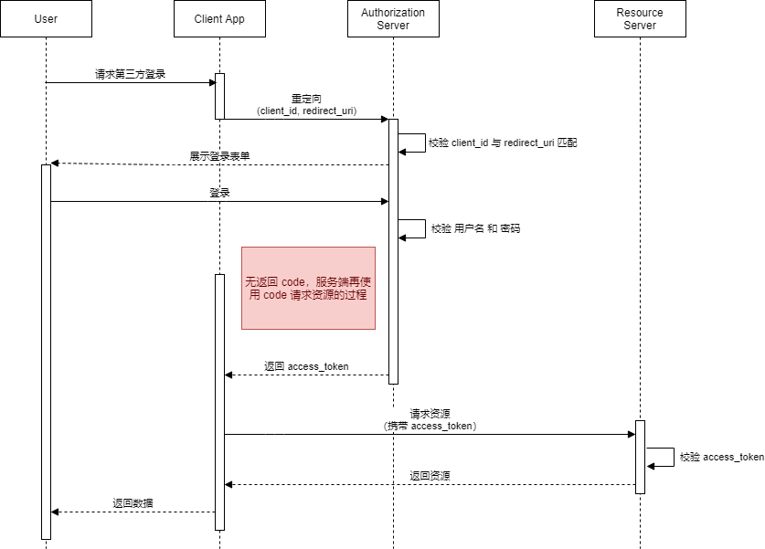
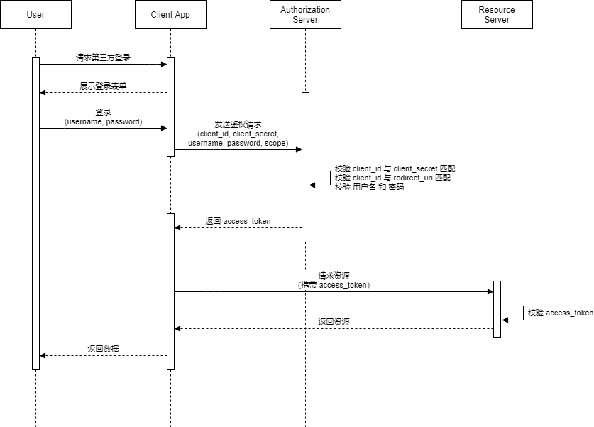
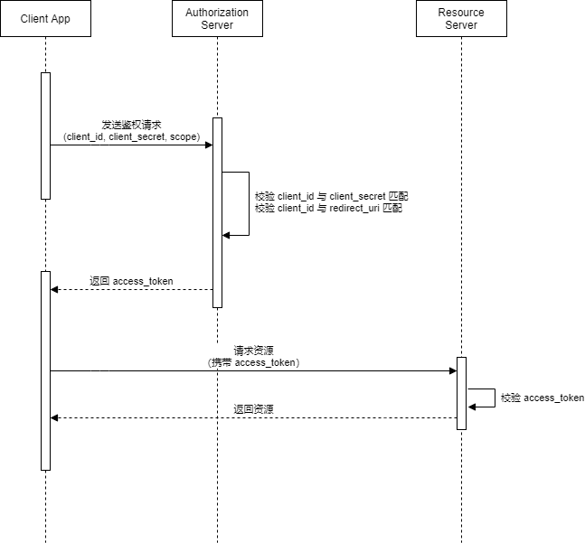
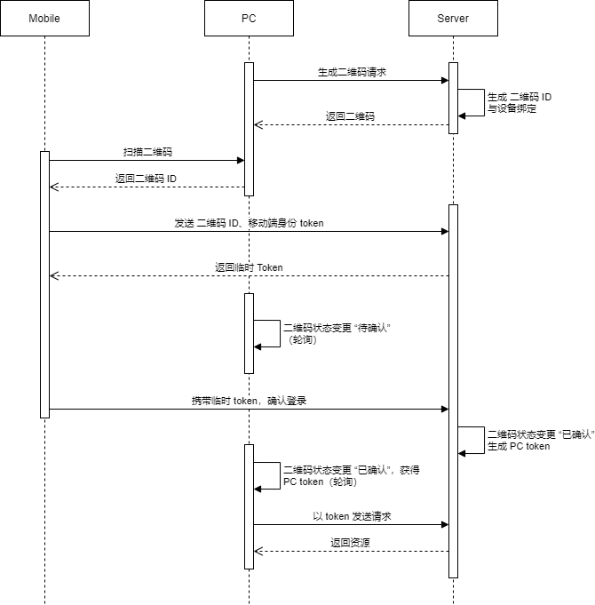

> [前端开发登录鉴权方案完全梳理](https://tsejx.github.io/blog/authentication/)  

## Http 基础认证（Http Basic Authentication）

> [HTTP 身份验证](https://developer.mozilla.org/zh-CN/docs/Web/HTTP/Authentication#%E5%9F%BA%E6%9C%AC%E9%AA%8C%E8%AF%81%E6%96%B9%E6%A1%88%E7%9A%84%E5%AE%89%E5%85%A8%E6%80%A7)  
> [NodeJS - Basic Authentication Tutorial with Example API](https://jasonwatmore.com/post/2018/09/24/nodejs-basic-authentication-tutorial-with-example-api)  


### 流程

  

上述流程图来自于 [MDN](https://developer.mozilla.org/zh-CN/docs/Web/HTTP/Authentication#%E5%9F%BA%E6%9C%AC%E9%AA%8C%E8%AF%81%E6%96%B9%E6%A1%88%E7%9A%84%E5%AE%89%E5%85%A8%E6%80%A7)，信息交互必须通过 HTTPS 连接以保证安全。  

### WWW-Authenticate 头 与 Authorization 头

WWW-Authenticate 头形如：  

```
WWW-Authenticate: <type> realm=<realm>
```

其中 `<type>` 为认证方案，：  

- `<type> = Basic`，要求使用 Base64 编码凭证；  
- `<type> = Bearer`，这一方案在 OAuth 2.0 中使用；  
- ...


Authorization 头形如：  

```
Authorization: <type> <credentials>
```

其中 `<credentials>` 为该认证方案下对应的认证数据。  


### Demo

以下是采用 Basic 方案的一个 Demo。（注意：偷懒没有使用 https，实际上是需要的）  

```js
import http from "http";

const basicRealm = 'Demo Site';
const users = [
  { username: 'user1', password: '123456' },
];

http.createServer((req, res) => {
  const { authorization } = req.headers;

  const RegexAuth = /^Basic (\w+)$/;
  if (!RegexAuth.test(authorization)) {
    res.statusCode = 401;
    res.setHeader(`WWW-Authenticate`, `Basic realm="${basicRealm}"`);
    res.end();
  } else {
    // base64 加密的字符串 <username>:<password>
    const credentials = RegExp.$1;
    const [username, password] = Buffer.from(credentials, 'base64').toString().split(':');
    // 校验用户
    const success = users.some(v => v.username === username && v.password === password);
    if (success) {
      res.statusCode = 200;
      res.end('Welcome!');
    } else {
      // 校验失败，继续返回 401
      res.statusCode = 401;
      res.setHeader(`WWW-Authenticate`, `Basic realm="${basicRealm}"`);
      res.end();
    }
  }
}).listen(8080);
```

### Proxy-Authenticate 头与 Proxy-Authorization 头

## 基于 Cookie 的认证

> [Cookies](https://auth0.com/docs/users/cookies)  

### 关于 session

在 Web 中，session 指用户与网站在给定时间内的一系列交互。  

### 关于 SameSite

在 Chrome 80 后，  

- Cookie 不设置 `samesite` 属性，会被设置为 `samesite = lax`；  
- 若 `samesite = none`，则必须在 HTTPS 上，否则 cookie 不会在浏览器中保存；  

### 有状态 cookie

一般是服务端维护 `session_id`，其对应了存储的用户信息（可以存储在内存中，数据库，缓存等），并 `Set-Cookie` 设置在浏览器中，后续浏览器带上 `session_id` 供服务端校验。  

优点：

1. 客户端只需要存储 `session_id`，不需要存储完整数据；  
2. 方便清除 session，易于注销登录；  

缺点：

1. 需要额外的存储，如数据库、Redis 等；  
2. 增加延迟，这是因为需要读写额外存储；  
3. 扩大规模难度高，这是由于高并发带来的性能瓶颈；  

### 无状态 cookie

一般为将需要使用的用户信息（如用户 ID）加密与签名后记录在 cookie 中，服务端校验时通过校验签名与解密获取这一信息。（如 JWT）  

优点：

1. 高性能，不需要读写数据库；  
2. 易于扩展，对分布式友好，因为自身信息全都在 cookie 中；  

缺点：

1. 存储信息有限，浏览器 cookie 通常最多存 4KB，同时占带宽；  
2. 取消（revoke）session 困难，服务器通常需要额外存储记录被取消的 session，这与无状态相悖；  

## 基于 Token 的认证

> [How JWT works — in depth](https://medium.com/swlh/how-jwt-works-in-depth-604c93ec20a4)  


可以认为，如果以 Cookie 作为存储，那么是无状态 Cookie 的一种方案。在使用 localStorage 作为存储的情况下，优缺点有：

优点：

1. 高性能，不需要读写数据库；  
2. 易于扩展，对分布式友好，因为 Token 自身包含了自身信息；  
3. 有效避免 CSRF，因为不需要 Cookie（这一点是无状态 Cookie 所没有的）；  
4. 支持不支持的 `Cookie`/`Set-Cookie` 机制的客户端；  

缺点：

1. 存储信息有限，浏览器 cookie 通常最多存 4KB，同时占带宽；  
2. 取消（revoke）session 困难，服务器通常需要额外存储记录被取消的 session，这与无状态相悖；  

### JWT

JWT (JSON Web Token) 是一种基于 Token 的认证方案，由 Auth0 提出。  

#### 格式

形如

```
<Header>.<Payload>.<Signature>
```

##### Header

Header 记录了 JWT 的基本信息，是形如以下 JSON 序列化后 Base64 加密的结果。  

```json
{
  // 签名算法
  "alg": "HS256",
  // 类型
  "typ": "JWT"
}
```

其他的 key 有 `cty`, `jku`, `jwk`, `kid` 等。  

##### Payload

Payload 同样为 JSON 序列化后 Base64 加密的字符串，这一 JSON 存放了 JWT 的实际数据，其有三种声明字段类型：

- `registered`：预定义的声明字段，由规范定义；  
- `public`：由使用 JWT 的其他规范定义，需要在 [IANA JSON Web Token Claims Registry](https://www.iana.org/assignments/jwt/jwt.xhtml#claims) 注册，或使用不太可能发送冲突的名字；  
- `private`：由使用 JWT 的应用定义，可以是任意名称； 

以下 7 个属性为 `registered` 类型的声明，在应用中不应该被覆盖：  

- `iss` (issuer)  
- `sub` (subject)  
- `aud` (audience)  
- `exp` (expiration time)：是 Unix 时间戳  
- `nbf` (not before)  
- `iat` (issued at)  
- `jti` (JWT ID)  

#### Signature

签名，顾名思义，用于防止 Header 与 Payload 是否被篡改，其计算方法如下：

```
// 从外部读入私钥
secret = {...}

header = {...}
payload = {...}
encodedString = base64UrlEncode(header) + "." + base64UrlEncode(payload);

hash_func = getFuncByAlg(header.alg);

signature = base64UrlEncode(hash_func(encodedString, 'secret'));
```

#### 注意事项

- 不应在 Payload 中存储敏感信息，因为采用的是 Base64 加密；  

#### 常见问题与解决方案

##### 注销问题

由于服务端不记录 session 状态，因此涉及注销场景（如 用户退出登录、更改密码、用户被删除 等）时，服务端需要做额外的操作才能实现。目前的解决方案有：

- **引入额外存储**：将 JWT 存入额外存储（一般是 Redis）中，使 Token 失效则在存储中将该 Token 删除，但这违背了无状态原则；  
- **黑名单机制**：与上述类似，只是将失效的 Token 放入额外存储中；  
- **保持短有效期并经常轮换**：用户需要经常登录，同时使注销有一定延时；  

##### 续签问题

Token 的有效期一般都不设置太长，因此需要续签。目前的解决方案有：

- **临近过期重新颁发**：请求时服务端发现 Token 快过期，则重新颁发 Token；  
- **每次请求都重新颁发**：开销大；  
- **双 Token**：服务端同时返回 access token 与 refresh token。access token 用于验证身份，有效期短（如 30 分钟）；refresh token 用于刷新 access token，有效期常（如 1 天）。客户端先将 access token 发送给服务端，若过期，再将 refresh token 发送给服务端以刷新 access token，若过期则重新登录；  


## 单点登录（Single Sign-on）

> [集中式认证服务](https://tsejx.github.io/blog/authentication/)  
> [CAS protocol](https://apereo.github.io/cas/4.2.x/protocol/CAS-Protocol.html)  

单点登录（Single Sign-on，SSO），是指在多系统群中登录单个系统，便可在其他系统中也取得授权，无需再次登录。这是一种分离业务系统与认证系统的操作。SSO 分为 **同域 SSO** 与 **异域 SSO**。  

### 同域 SSO

假设有两个系统分别通过域名 `a.example.com` 与 `b.example.com` 进行访问，那么他们实现 SSO 的流程可以如下：

  

### 跨域 SSO

CAS（Central Authentication Service，集中式认证服务）是一种针对万维网的 SSO 协议，基于 客户端、Web 应用、CAS 服务器之间的票据验证。  

三方角色：

- 客户端；
- Web 应用；  
- CAS 服务器；  

CAS 需要实现的接口：  

- `/login`：用户登录 CAS  
- `/logout`：用户登出 CAS  
- `/validate`: 验证用户是否登录 CAS  
- `/serviceValidate`：Web 应用验证用户是否登录 CAS  

CAS 相关票据：

- **TGT (Ticket Grangting Ticket)**：CAS 为用户签发的关于自己的登录票据，存储在 CAS 内部，是 <TGC, 用户信息> 键值对；  
- **TGC (Ticket Granting Cookie)**：CAS 与 用户之间的 Session Cookie；  
- **ST (Service Ticket)**：CAS 为用户签发的关于某个 Web 应用的登录票据。在用户访问某个 Web 应用时，若没有 ST，则该应用会要求用户去 CAS 获取 ST，CAS 通过用户 Cookie 中的 TGC 有对应的 TGT 后，签发 ST 给用户，用户再拿着 ST 给 Web 应用，Web 应用拿 ST 给 CAS 校验；  



CAS 流程如下：  

  

### LDAP 认证登录

> [轻型目录访问协议](https://zh.wikipedia.org/wiki/%E8%BD%BB%E5%9E%8B%E7%9B%AE%E5%BD%95%E8%AE%BF%E9%97%AE%E5%8D%8F%E8%AE%AE)  
> [LDAP概念和原理介绍](https://www.cnblogs.com/wilburxu/p/9174353.html)   

LDAP (轻型目录访问协议, Light Directory Access Portocol) 基于 X.500，由目录数据库（一种读快写慢，树状结构的数据库）与一套访问协议组成，可用于存储 企业的组织架构、人员信息等。其常作为认证源，存储用户密码、提供认证方式，在 SSO 使用。（注意，LDAP 并不能实现 SSO，但可以参与 SSO。）  

## OAuth 2.0

OAuth (开放授权) 用于第三方登录，如 QQ、微信、Github 等。  

### 涉及角色

- 资源拥有者 (Resource Owner): 用户  
- 第三方应用 (Third-party Application): 请求认证方  
- 授权服务器 (Authorization Server): 认证方 （如 `Github`）  
- 资源服务器 (Resource Server): 认证方对应的资源服务器 （如接入 `Github` 后可调用 Github API，这些 API 背后的服务器）  

### 字段

- `client_id`: 在授权服务方上注册得到的 id，可以公开；  
- `client_secret`: 在授权服务方上注册得到的 secret，不能公开；  
- `redirect_uri`: 回调 uri，一般需要与在授权服务方上注册的 uri 相同；  
- `scope`: 授权作用域列表，每个作用域对应了不同 api 的请求权限；  

### 授权模式

- 授权码模式 (Authorization Code Grant)  
- 隐式授权模式 (Implicit Grant)  
- 密码模式 (Resource Owner Password Credentials Grant)  
- 客户端模式 (Client Credentials Grant)  

#### 授权码模式

  

#### 隐式授权模式

此模式可以没有后端参与。  

  

#### 密码模式



#### 客户端模式

此模式下没有前端参与。



## 扫码登陆

  

## 一键登录

### QQ 的一键登录

> [QQ 快速登录的实现原理](https://blog.csdn.net/rinsmelody/article/details/75331962)  

通过客户端本地设立服务器并监听，浏览器向服务器（localhost）发送请求获取相关信息。  

### 手机号的一键登录（略）

此处略。

