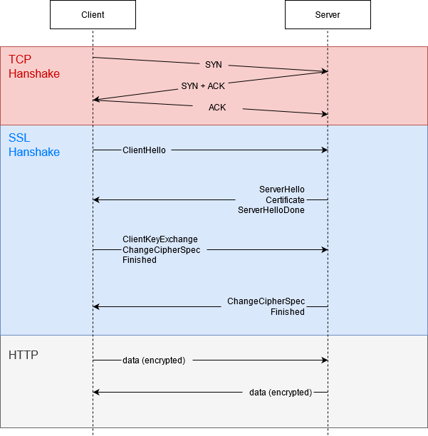

## 特性

- **防窃听**：加密传播
- **防篡改**：校验机制
- **防冒充**：身份证书

## 过程

服务端向客户端索取并验证公钥，双方协商生成对话密钥（session key），双方使用对话密钥加密通信。



### Client Hello

> ClientHello

- 支持的协议版本`Version`（如 TLS v1.2）
- 一个客户端生成的随机数
- 支持的加密方法`Ciphers Suites`（如 RSA 公钥加密）
- 支持的压缩方法

### Server Hello

> ServerHello  
> Certificate (optional)  
> ServerKeyExchange (optional，DH 算法需要)  
> Certificate Request (optional)  
> ServerHelloDone

- 确认使用的协议版本，若服务器与客户端支持版本不一致，服务器则关闭通信
- 一个服务器生成的随机数
- 确认加密方法`Ciphers Suite`
- 服务器证书`Certificate`，包含公钥 （public key）

后通知客户端`Server Hello`过程结束（`ServerHelloDone`）

### 客户端回应

> ClientKeyExchange  
> \[ChangeCipherSpec\]  
> Finished (i.e. Encrypted Handshake Message)

客户端首先验证服务器证书（通过信任 CA 列表中的公钥对比）。若不是可信机构颁布的、或证书中的域名与实际域名不一致、或证书已过期，则会向用户显示警告，由其选择是否继续通信

从证书中取出公钥，后向服务器提供：

- 客户端生成的随机数`pre-master-key`，使用**公钥**加密（`ClientKeyExchange`）
- 编码改变通知，表示随后的信息都将用双方商定的加密方法和密钥发送（`ChangeCipherSpec`）
- 客户端握手结束通知，表示客户端握手阶段已结束。其包含前面发送的所有内容的 hash 值（摘要），通过 session key 加密，用于服务器校验。服务端接收后用 session key 解密，能解密说明双方 session key 一致

客户端使用之前确认的加密方法与三个随机数生成会话密钥`session key`

### 服务端回应

> [ChangeCipherSpec]
> Finished （i.e. Encrypted Handshake Message）

服务端使用自己的**私钥**解密收到`pre-master-key`后生成会话密钥，后向客户端发送：

- 编码改变通知（`ChangeCipherSpec`）
- 服务器握手结束通知，表示服务器的握手阶段已结束。其包括了前面发送的所有内容的 hash 值（摘要），通过 session key 加密，用来向客户端校验。客户端接收后用 session key 解密，能解密说明双方 session key 一致

至此，整个握手阶段全部结束。接下来，客户端与服务器进入加密通信，即 HTTP 通信 + session key 加密，当经过 TLS/SSL 层时标记为已加密

## HTTPS 证书

### 使用 OpenSSL 进行证书制作与自建 CA

> https://ningyu1.github.io/site/post/51-ssl-cert/  
> https://www.cnblogs.com/f-ck-need-u/p/7113610.html  
> https://www.cnblogs.com/jmilkfan-fanguiju/p/10589756.html  
> https://deliciousbrains.com/ssl-certificate-authority-for-local-https-development/

**以下仅作为了解过程用，开发环境下这样做太麻烦**

使用 OpenSSL 建立 CA 与 证书。

```
openssl genrsa -out myCA.key 2048

openssl req -x509 -new -nodes -key myCA.key -sha256 -days 1825 -out myCA.crt
```

为 CA 创建 2048 位 RSA 私钥，并创建证书。

```
openssl genrsa -out server.key 1024
```

为服务器生成 1024 位 RSA 私钥。

根据这一私钥，生成证书申请文件 csr，其包括了：

- 个人信息：服务器域名 等
- 公钥：公钥算法、长度与内容
- 数字签名：请求文件的数字签名算法与内容

```
openssl req -new -key server.key -out server.csr
```

根据私钥 server.key，生成证书申请文件。

```
openssl x509 -req -in server.csr -CA myCA.pem -CAkey myCA.key -CAcreateserial -out server.crt -days 3650 -sha256 -extfile server.ext
```

根据证书申请文件与 CA 证书、私钥等生成证书 server.crt，有效期为 3650 天。X.509 定义了公钥证书的基本结构。

这里的 server.ext 如下，`DOMAIN` 需要替换为域名

```
authorityKeyIdentifier=keyid,issuer
basicConstraints=CA:FALSE
keyUsage = digitalSignature, nonRepudiation, keyEncipherment, dataEncipherment
subjectAltName = @alt_names

[alt_names]
DNS.1 = DOMAIN
```

### 开发过程中制作自签名证书

直接用库 `selfsigned` 生成，以下是一个可行的例子。若需要走自建 CA，可参考 [这个 PR](https://github.com/jfromaniello/selfsigned/pull/43)。

```ts
import https from "https";
import selfsigned from "selfsigned";

const serverCert = selfsigned.generate([{ name: "commonName", value: "localhost" }], {
  keySize: 1024, // the size for the private key in bits (default: 1024)
  days: 365, // how long till expiry of the signed certificate (default: 365)
  algorithm: "sha1", // sign the certificate with specified algorithm (default: 'sha1')
  extensions: [{ name: "basicConstraints", cA: false }], // certificate extensions array
});

https
  .createServer(
    {
      key: serverCert.private,
      cert: serverCert.cert,
    },
    (req, res) => {
      res.writeHead(200);
      res.end("hello world\n");
    }
  )
  .listen(8000);

console.log("https://localhost:8000");
```

### 证书验证

> [浏览器如何验证 HTTPS 证书的合法性？ - 小林 coding 的回答 - 知乎](https://www.zhihu.com/question/37370216/answer/1914075935)  
> [你并不在意的 HTTPS 证书吊销机制，或许会给你造成灾难性安全问题！](https://cloud.tencent.com/developer/article/1588398)

#### 完整性验证

各大浏览器与操作系统已经维护了所有的权威证书机构的名称与公钥。客户端获取到证书时，证书签名部分是被 CA 私钥加密的。客户端找到相应的 CA 的公钥，解密证书签名部分，并通过相同规则生成证书签名，生成的签名若与证书中解密后的签名一致，则说明证书是有效的。

#### 有效期验证

顾名思义

#### 吊销状态检测

吊销检查协议有：`CRL`和`OCSP`

- CRL：全量文件，访问地址记录在证书中，记录了被此 CRL 限制的证书中所有被吊销证书的序列号
- OCSP：TCP 服务，访问地址记录在证书中，通过请求证书序列号，服务器告知当前序列号是否在吊销名单中
