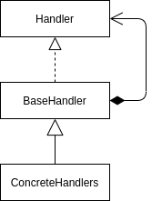

<Reference
entries={[
["责任链模式", "https://refactoringguru.cn/design-patterns/chain-of-responsibility"]
]}
/>

## 特点

**责任链模式** 属于 **行为型模式**，其在多个对象处理同一请求的场景下，将这些对象组织为一条链，以实现多个对象之间、请求与对象之间的解耦。

## 结构



- Handler (处理者): 处理者接口，有方法：
  - setNext: 设置下一处理者；
  - handle: 处理请求；
- BaseHandler (基础处理者): 实现了处理者接口的通用类，一般提供了 setNext 的基本实现；
- Concrete Handlers (具体处理者): 处理者的具体实现，每个处理者需要决定请求是否需要下一个处理者处理；

## 例子：请求处理（TypeScript 实现）

```ts
interface IHandler {
  setNext: (h: IHandler) => void;
  handle: (request: any) => void;
}

abstract class Handler implements IHandler {
  _next: IHandler | null = null;

  next(request: any) {
    if (this._next) {
      this._next.handle(request);
    }
  }

  setNext(h: IHandler) {
    this._next = h;
  }

  abstract handle(request: any): void;
}

class CookieHandler extends Handler {
  handle(request: any) {
    // ...
    this.next(request);
  }
}

class JsonHandler extends Handler {
  handle(request: any) {
    // ...
    this.next(request);
  }
}

function handleRequest(request: any) {
  const cookieHandler = new CookieHandler();
  const jsonHandler = new JsonHandler();
  cookieHandler.setNext(jsonHandler);

  cookieHandler.handle(request);
}
```

## 优缺点

优点

- 处理请求对象顺序可控；
- 单一职责原则；
- 开闭原则；

缺点

- 部分请求可能未被处理；

## 常见场景

### 浏览器事件机制

浏览器事件冒泡、捕获机制为这一模式：

- 事件通过捕获、冒泡在链上传播，每一个 handler 都可处理事件；
- 可以通过 `event.stopPropagation` 阻断传播；

### 中间件机制

前端接触的一般有：

- express、koa 中间件：请求到来后，通过多个中间件组成的链依次处理；
- redux 中间件；
