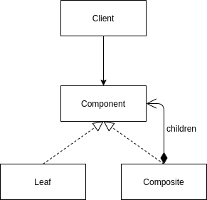

<Reference
entries={[
["组合模式", "https://refactoringguru.cn/design-patterns/composite"],
["精读《设计模式 - Composite 组合模式》", "https://zhuanlan.zhihu.com/p/307385425"],
]}
/>

## 概述

**组合模式** 属于结构型模式，允许将对象组织为树形结构，并且能够像独立对象一样使用他们。

## 结构



- Component (组件)：共有接口；
- Composite (Container, 组合 / 容器)：包含其他实现了 Component 的容器；
- Leaf (叶节点)：不包含子项目；

## 例子：文件系统 (TypeScript 实现)

假设实现文件系统中的文件 (File) 与目录 (Directory)，并实现 API `findAllMatchedNodes` 用于找到所有满足条件的节点，则可以实现如下：

```ts
// 共有接口
interface Node {
  name: string;
  children: Node[] | null;
  findAllMatchedNodes: (name: string) => Node[];
}

class File implements Node {
  children: Node[] | null = null;
  constructor(public name: string) {}

  findAllMatchedNodes(name: string): Node[] {
    return name === this.name ? [this] : [];
  }
}

class Directory implements Node {
  children: Node[] | null = [];
  constructor(public name: string) {}

  findAllMatchedNodes(name: string): Node[] {
    const base: Node[] = name === this.name ? [this] : [];
    return [...base, ...(this.children ?? [])?.map((v) => v.findAllMatchedNodes(name)).flat()];
  }
}

declare const root: Node;
const result = root.findAllMatchedNodes("a.txt");
```

## 优缺点

优点：

- 可利用多态与递归机制使用树结构；
- 开闭原则；

缺点：

- 对功能差异较大的类，提供共有接口会有困难。如上例中的 `File` 实现了 `findAllMatchedNodes`，实际上语义上 `File` 不应该再出现 "查找全部" 这一语义。在其他情况中，可能需要使用 noop 来实现接口，这使得 client 需要感知实现细节；
