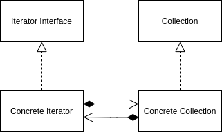

<Reference
entries={[
["迭代器模式", "https://refactoringguru.cn/design-patterns/iterator"]
]}
/>

## 概述

**迭代器模式** 属于行为型模式，能够在不暴露底层表现形式的情况下遍历集合（此处指 Collection，而不是 Set）。

## 结构



- Iterator Interface (迭代器接口)：有获取下一个迭代器等方法；
- Collection Interface (集合)；
- Concrete Interface (具体迭代器)；
- Concrete Collection (具体集合)；

## 例子：基于迭代器的 find 算法

```ts
interface Ref<T> {
  deref: () => T;
}

interface ForwardIterator<T> {
  elementReference: Ref<T>;
  next(): ForwardIterator<T>;
}

declare class LinkedList<T> {
  begin(): ForwardIterator<T>;
  end(): ForwardIterator<T>;
}

declare class Vector<T> {
  begin(): ForwardIterator<T>;
  end(): ForwardIterator<T>;
}

function find<T>(begin: ForwardIterator<T>, end: ForwardIterator<T>, targetRef: Ref<T>): ForwardIterator<T> | null {
  let it = begin;
  while (it !== end) {
    if (it.elementReference.deref() == targetRef.deref()) {
      return it;
    }
    it = it.next();
  }
  return null;
}
```

## 应用

### C++ 中的 STL 容器与 STL 算法

C++ 中的 STL 容器如 `map`, `set`, `vector` 等实现了迭代器，同时 STL 算法如 `find` 等接受迭代器实现算法。

### JavaScript 中的 iterator

JavaScript 通过 iterator 可以使用 `for...of`，扩展运算符（`...`） 等。
