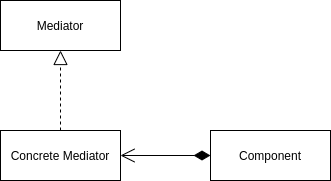

<Reference
entries={[
["中介者模式", "https://refactoringguru.cn/design-patterns/mediator"],
]}
/>

## 概述

**中介者模式** 属于行为模式，该模式会限制对象之间的直接相互交互，有助于减少对象间的无序依赖关系。

## 结构



- Mediator (中介者)：中介者接口，常常会包含一个通知方法供组件调用，根据组件传递的参数通知对应的组件；
- Concrete Mediator (具体中介者)：实现中介者接口，并保存所有组件的引用；
- Component (组件)：包含业务逻辑，通过调用中介者提供的接口与其他组件通信；

## 例子：GUI 程序

在以下例子中，存在一个按钮 (Button) 与一个文本框 (TextArea)：

- 点击按钮时，设置文本框内容为 "Input something here."；
- 文本框内容变更时，同步变更内容；

```ts
interface Evt {
  name: "click" | "change";
  component: Component;
}

interface Mediator {
  notify: (event: Evt) => void;
}

class Component {
  constructor(protected app: Mediator) {}
}

class Button extends Component {
  onClick() {
    this.app.notify({ name: "click", component: this });
  }
}

class TextArea extends Component {
  private state!: string;
  onChange() {
    this.app.notify({ name: "change", component: this });
  }
  set(text: string) {
    this.state = text;
  }
  get(): string {
    return this.state;
  }
}

class App implements Mediator {
  private button!: Button;
  private textArea!: TextArea;

  constructor(private state = "") {}

  notify(evt: Evt) {
    if (evt.name === "click" && evt.component instanceof Button) {
      // 为文本框设置默认值
      this.textArea.set("Input something here.");
    }
    if (evt.name === "change" && evt.component instanceof TextArea) {
      this.state = this.textArea.get();
    }
  }

  initialize() {
    this.button = new Button(this);
    this.textArea = new TextArea(this);
  }
}
```

## 优缺点

优点：

- 单一职责原则；
- 开闭原则；
- 减轻多个应用间的耦合情况；

缺点：

- 中介者可能会成为上帝对象；

## 应用

### React 的组件

在简单的 React 组件中，各组件通过父组件通信，而不直接向对方传递信息，类似于中介者模式。
