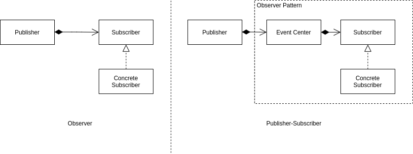

<Reference
entries={[
["观察者模式", "https://refactoringguru.cn/design-patterns/observer"]
]}
/>

## 概述

**观察者模式** 属于行为模式，允许定义订阅机制，在事件发生时通知若干个订阅 (Subscribe) 某个对象的其他对象。

**发布订阅模式** 可以认为是 观察者模式 的变体，其利用 中介者模式 规范了订阅多个对象的情况。

## 结构



对于 观察者模式 (Observer)：

- Subscriber (订阅者接口)：声明了通知接口 `update` 用于接受来自于 Publisher 的通知；
- Concrete Subscriber (订阅者)；
- Publisher (发布者)：包含一个或多个 Subscriber 的引用，当发生事件时调用相应的 Subscriber 的 `update` 方法以通知；

对于 发布订阅模式 (Publisher-Subscriber)：

其在 Publisher 与 Subscriber 之间加入了 EventCenter (事件订阅中心)，Publisher 向 EentCenter 发送事件，Subscriber 从 EventCenter 订阅事件，实现了 Publisher 与 Subscriber 之间的解耦，同时减少。

另外，EventCenter 与 Subscriber 之间可以看作观察者模式。

## 例子 (TypeScript 实现)

假设两个服务器类 `Server`, `AnotherServer` 都需要监听 `Client` 的 ready 事件，则使用发布订阅模式实现如下。

对于强类型语言，使用发布订阅模式在类型定义上可能会有些困难。

```ts
type Listener = (data: any) => void;
type EventType = string;

class EventCenter {
  private listeners: Map<EventType, Set<Listener>> = new Map();

  public subscribe(eventType: EventType, listener: Listener) {
    const set = this.listeners.get(eventType) ?? new Set();
    set.add(listener);
    this.listeners.set(eventType, set);
  }

  public unsubscribe(eventType: EventType, listener: Listener) {
    const set = this.listeners.get(eventType);
    if (set) {
      set.delete(listener);
      if (set.size === 0) {
        this.listeners.delete(eventType);
      }
    }
  }

  public notify(eventType: EventType, data: any) {
    const set = this.listeners.get(eventType);
    if (set) {
      for (const listener of set) {
        listener(data);
      }
    }
  }
}

class Server {
  constructor(private evtCenter: EventCenter) {
    evtCenter.subscribe("ready", this.handleClientReady.bind(this));
  }

  handleClientReady() {
    // -- snip --
  }
}

class AnotherServer {
  constructor(private evtCenter: EventCenter) {
    evtCenter.subscribe("ready", this.handleClientReady.bind(this));
  }

  handleClientReady() {
    // -- snip --
  }
}

class Client {
  constructor(private evtCenter: EventCenter) {
    evtCenter.notify("ready", this);
  }
}
```

## 优缺点

优点：

- 开闭原则；
- 可以在运行时建立对象间的联系；
