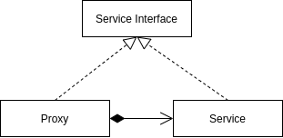

<Reference
entries={[
["代理模式", "https://refactoringguru.cn/design-patterns/proxy"],
["JavaScript 设计模式（三）：代理模式", "https://segmentfault.com/a/1190000019574843"],
]}
/>

## 概述

**代理模式** 属于结构型模式，通过创建代理对象控制对于原对象的访问。

## 结构



- Service Interface (服务接口)
- Service (服务)：服务类，用于提供业务逻辑；
- Proxy (代理)：代理类包含了服务类实例，代理这一服务类实例完成任务；

## 例子：图片预加载

```ts
interface ICustomImage {
  init: () => void;
  setSrc: (src: string) => void;
}

class CustomImage implements ICustomImage {
  private imgEl: HTMLImageElement | null = null;

  init() {
    this.imgEl = document.createElement('img');
    document.body.appendChild(this.imgEl);
  }
  setSrc(src: string) {
    if (this.imgEl) {
      this.imgEl.src = src;
    }
  }
}

class PreloadCustomImage implements ICustomImage {
  static LOADING_IMAGE_URL = './loading.gif';
  private customImageService: ICustomImage;

  constructor(service: ICustomImage) {
    this.customImageService = service;
  }

  init() {
    return this.customImageService.init();
  }

  setSrc(src: string) {、
    // 后台加载真实图片
    // 加载后将 service 的图片置换
    const img = new Image();
    img.onload = () => {
      this.customImageService.setSrc(src);
    }
    img.src = src;

    // 设置 loading 图片
    this.customImageService.setSrc(PreloadCustomImage.LOADING_IMAGE_URL);
  }
}

const proxyImage = new PreloadCustomImage(new CustomImage());
proxyImage.init();
```

## 优缺点

优点：

- 可控制服务对象，且对客户端透明；
- 可在服务对象未准备完成的情况下工作；
- 开闭原则：在不修改服务与客户端的情况下创建新代理；

缺点：

- 代码可能变复杂；

## 应用

### 虚拟代理

虚拟代理用于将对象延迟到需要时再实例化，将操作延迟到需要时才执行等。

### 缓存代理

缓存代理用于为对象提供操作结果缓存。

### 保护代理

保护代理用于访问控制，允许特定的客户端使用对象。

### 远程代理

远程代理适用于服务对象位于远程服务器场景。

### ES2015 Proxy

ES2015 [Proxy](https://developer.mozilla.org/zh-CN/docs/Web/JavaScript/Reference/Global_Objects/Proxy) 用于创建一个对象的代理，实现基本操作（属性查找，赋值、函数调用等）的拦截和自定义。
