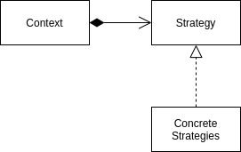

<Reference
entries={[
["策略模式", "https://refactoringguru.cn/design-patterns/strategy"]
]}
/>

## 概述

**策略模式** 属于行为模式，允许定义一系列算法并将每种算法放入独立的类中，以使得算法可以互相替换。

## 结构



- Context (上下文)：指向具体策略的引用，客户端通过 context 对象设置与执行策略；
- Strategy (策略)：策略接口，通常只包含一个执行策略的接口；
- Concrete Strategies (具体策略集)；

## 例子：表单验证

可以实现一系列表单验证策略实现表单验证。

此例将 `setStrategy` 变形为 `setStrategies` 以执行多个算法。

```ts
interface IStrategy {
  test: (value: string) => boolean;
}

class IsEmailStrategy implements IStrategy {
  test(value: string): boolean {
    return value.includes("@");
  }
}

class IsValidPasswordStrategy implements IStrategy {
  test(value: string): boolean {
    return value.length >= 6;
  }
}

class StrategyContext {
  private strategies: IStrategy[] = [];

  setStrategies(stragtegies: IStrategy[]) {
    this.strategies = stragtegies;
  }

  run(value: string) {
    return this.strategies.every((f) => f.test(value));
  }
}

const context = new StrategyContext();
context.setStrategies([new IsEmailStrategy()]);
context.run("example@a.com");

context.setStrategies([new IsEmailStrategy(), new IsValidPasswordStrategy()]);
context.run("example@a.com");
```

## 优缺点

优点：

- 运行时切换算法；
- 分离算法的实现与使用；
- 开闭原则：无需修改 Contxt 即可引入新策略；

缺点：

- 在算法极少发生改变时，使用该模式会导致代码便复杂；
- 客户端必须知晓策略；
- 可以使用 lambda 函数简化类；

## 应用

### 前端中的表单校验

由于 JavaScript 支持 lambda 函数且函数是一等公民，因此可以将策略集写为对象数组的形式。将示例改为：

```ts
type IStrategy = (value: string) => boolean;

const createStrategies = <P extends string>(strategies: Record<P, IStrategy>) => strategies;

const runStrategies = (strategies: IStrategy[]) => (value: string) => strategies.every((f) => f(value));

const strategies = createStrategies({
  isEmail: (value) => value.includes("@"),
  isValidPassword: (value) => value.length >= 6,
});

runStrategies([strategies.isEmail])("example@a.com");
runStrategies([strategies.isEmail, strategies.isValidPassword])("example@a.com");
```
