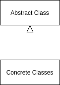

<Reference
entries={[
["模板方法模式", "https://refactoringguru.cn/design-patterns/template-method"]
]}
/>

## 概述

**模板方法模式** 属于行为模式，其在超类中定义了算法框架，允许子类在不修改结构的情况下重写算法的特定步骤。

## 结构



- Abstract Class (抽象类): 声明若干个算法的步骤方法，其可能抽象类型，也可能是默认实现步骤；
- Concrete Classes (若干个具体类): 继承抽象类，并实现其上的步骤方法；

## 例子

假设要实现对不同的 `GitService` 以支持 PR 等方法，则可以实现如下：

```ts
type GitInfo = any;

abstract class GitService {
  abstract getInfo(): Promise<GitInfo>;
  abstract pullRequest(): Promise<void>;
}

class GerritService extends GitService {
  getInfo() {
    // -- snip --
  }

  pullRequest() {
    // -- snip --
  }
}

class GitlabService extends GitService {
  getInfo() {
    // -- snip --
  }

  pullRequest() {
    // -- snip --
  }
}

async function main() {
  // -- snip --

  const gitService: GitService = new GitlabService();
  gitService.pullRequest();
}
```

## 优缺点

优点：

- 允许重写大型算法的特定部分，使算法其他部分修改对其造成的影响减少；
- 可以将重复代码提取到超类中；

缺点：

- 受算法框架限制；
- 子类重写默认步骤可能会违反里氏替换原则；
- 模板方法中的步骤越多，维护起来越困难；

## 应用

### React 类组件

React 类组件编写 `render`, `componentDidUpdate` 等方法实际上运用模板方法模式。

另外，Vue、Angular 类组件实际上也运用了这一模式。
