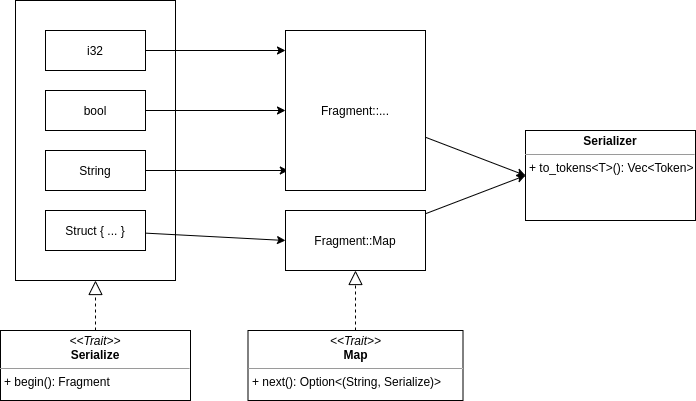
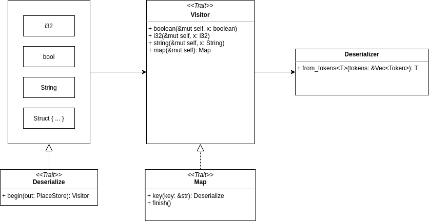

## 前言

说来惭愧，搞 Rust 以来一直也只能写一些业务级别的代码，库级别的代码写不来。因此专门开一个新的系列 “从库学 Rust”，希望通过学习实现 Rust 一些库的 Demo 版本来提高对 Rust 的理解与编码水平。

本文实现了一个简化版本的 [miniserde](https://github.com/dtolnay/miniserde)，在原本的基础上做出以下简化：

- 重点考虑实现序列化 API 为 `to_tokens`，反序列化 API 为 `from_tokens`；
- 只支持 `bool`, `i32`, `String` 与 struct；
- 针对 Token，而非字符串；
- 不考虑性能、合法性校验等；

本文源码保存在了 [Github](https://github.com/hpp2334/demo-minimini-serde)。

本文的 TODO：

- 读 serde 源码后加以比较；

## Serialize

### 整体思路



整体上，为类型实现 `Serialize` trait，使得它们有能力转为 `Fragment`，不同 Serializer（如 JSON Serializer）基于 `Fragment` 做序列化结果计算。

### Serialize 基础类型

对于基础类型 `i32`, `bool`, `String`，直接将自身的值挂到 `Fragment` 上。如以下对于 `bool` 类型的实现。

```rust
pub enum Fragment {
    Boolean(bool),
    // ...
}

impl Serialize for bool {
    fn begin(&self) -> Result<Fragment> {
        Ok(Fragment::Boolean(*self))
    }
}
```

### Serialize struct

对于 struct，实现 通过 `Serialize` macro，使得可以通过 `derive(Serialize)` 的方式将自身转为 `Fragment::Map(Map)`，这里的 Map 是一个迭代器，通过 `next` 方法能够拿到 `(String, Serialize)` KV 对，对应于结构体每一项的 key 与 value。

具体实现上，`Map` 记录了:

- 结构体自身的引用；
- 迭代器内部枚举下标；

```rust
struct __Map<'a> {
    // 结构体值自身引用，#ident 是 结构体名
    data: &'a #ident,
    cur: usize
}
```

为 `Map` 实现 `Map` trait。由于是写在 macro 里的，直接枚举 key 即可。

```rust
impl<'a> ser::Map for __Map<'a> {
    fn next(&mut self) -> Option<(String, &dyn Serialize)> {
        match self.cur {
            #(#indexes => {
                self.cur += 1;
                // 枚举结构体 key
                let key = #field_name_list;
                let value = &self.data.#field_ident_list;
                Some((key.to_owned(), value))
            },)*
            _ => None
        }
    }
}
```

从这里也可以看出 `Map` 使用迭代器的好处：外部调用者只需要能够获取 KV 对，并不需要感知内部的具体结构。使用迭代器一来把内部复杂的结构屏蔽了（也许并不复杂= =），二来按需取值，不需要一次性返回，有利于优化内存效率。

### `to_tokens` 实现

到这里 `to_tokens` 的实现就比较明显了：

- 对于基础类型，直接取值转为 `Token`；
- 对于 struct，遍历迭代器取 key-value，然后对 value 再做递归；

```rust
// UnsafeRcVec<T> 是对 Vec<T> 的封装，使得能够在 Rc 包裹下同时持有 &mut
fn to_token_impl(v: &dyn Serialize, mut vec: UnsafeRcVec<Token>) -> Result<()> {
    let fragment = Serialize::begin(v)?;

    match fragment {
        Fragment::I32(x)     => { vec.push(Token::I32(x)); }
        Fragment::Boolean(x) => { vec.push(Token::Boolean(x));  }
        Fragment::String(x)  => { vec.push(Token::String(x)); }
        Fragment::Map(mut map) => {
            let mut should_push_comma = false;

            vec.push(Token::LB);
            while let Some((key, v)) = map.next() {
                if should_push_comma {
                    vec.push(Token::Comma);
                }
                should_push_comma = true;

                vec.push(Token::String(key));
                vec.push(Token::Colon);
                to_token_impl(v, vec.clone())?;
            }
            vec.push(Token::RB);
        }
    }

    Ok(())
}
```

## Deserialize

### 整体思路



整体上，为支持类型实现 `Deserialize` trait，使得不同的 Deserializer 有能力通过统一的 `Visitor` trait 向属于这一类型的存储变量内部写入反序列化结果。

### PlaceStore

`PlaceStore` 是一个允许同时持有并写入的结构，其是核心是 `Rc<Option<T>>`，由 `Rc` 提供同时持有的能力。当有了 `PlaceStore` 后，就可以赋予 `Visitor` 能力，此时 `PlaceStore` 被外围方法和自身（作为 `Visitor`）同时持有，由 `Visitor` 在工作流程中写入值，外围函数在工作结束后将值取出。

```rust
pub struct PlaceStore<T> {
    out: Rc<Option<T>>,
}

impl<T> PlaceStore<T> {
    pub fn set(&mut self, value: T) {
        let inner = unsafe { Rc::get_mut_unchecked(&mut self.out) };
        *inner = Some(value);
    }
    pub fn try_unwrap(mut self) -> Result<T> {
        let out = unsafe { Rc::get_mut_unchecked(&mut self.out) };
        out.take().ok_or(Error)
    }
    pub fn clone(&self) -> Self {
        Self {
            out: Rc::clone(&self.out),
        }
    }
}
```

### Visitor

`Visitor` trait 代表了向内部写入值的能力，在默认实现中，将所有实现都置为未实现，由实现方做方法实现覆盖。

这里的 `Visitor` 确实就是设计模式中的 [访问者模式](/design-pattern/visitor/)，面向了一组不同类型存储对象提供写入自身的能力。

```rust
pub trait Visitor {
    fn boolean(&mut self, _x: bool) -> Result<()> {
        unimplemented!()
    }
    fn i32(&mut self, _x: i32) -> Result<()> {
        unimplemented!()
    }
    fn string(&mut self, _x: &str) -> Result<()> {
        unimplemented!()
    }
    fn map(&mut self) -> Result<Box<dyn Map>> {
        unimplemented!()
    }
}
```

### `make_place!`

由于 `PlaceStore` 后续需要 `impl Visitor`，但对于外部 crate，引入 `PlaceStore` 实现 `Visitor` trait 违背孤儿规则，因此，这里可以编写一个 macro `make_place!` 把 `PlaceStore` 包一层。

```rust
#[macro_export]
macro_rules! make_place {
    ($name:ident) => {
        pub struct $name<T> {
            pub out: PlaceStore<T>,
        }
    };
}
```

这样对于外部 crate，就可以编写代码如：

```rust
make_place!(_Place);

impl Visitor for _Place {
    // ...
}
```

同时为了方便本 crate 的使用，写下 `make_place!(Place)` 以后续对 `Place` 实现 `Visitor` trait。

### Deserialize 基础类型

这里以 `bool` 为例。对 `bool` 实现 `Deserialize` trait，其内部对 `Place<bool>` 实现 `Visitor` trait，在 `Visitor` trait 中覆盖 `boolean` 方法，使得此方法调用时可将值写入外部传入的 `PlaceStore` 中。

```rust
impl Deserialize for bool {
    fn begin(out: PlaceStore<Self>) -> Box<dyn Visitor> {
        impl Visitor for Place<bool> {
            fn boolean(&mut self, x: bool) -> Result<()> {
                self.out.set(x);
                Ok(())
            }
        }

        let place = Place { out };
        Box::new(place)
    }
}
```

### Deserialize struct

对于 struct，重点在于对 `Map` trait 的实现上。

内部构造 `__Map`，其枚举 struct 的每一个字段，并分别配上一个 `PlaceStore`。另外，还需要维护自身对应的 `PlaceStore`。

```rust
struct __Map {
    #(#field_ident_list: PlaceStore<#field_ty_list>,)*
    __out: PlaceStore<#ident>
}
```

这样当外部调用 `key` 方法时，可以通过 key 对应的 `PlaceStore` 创建对应的 `Visitor`。  
当外部调用 `finish` 方法时，将各字段对应的 `PlaceStore` 中的值提取出来并构造自身值，最后写入自身的 `PlaceStore` 中。

```rust
impl de::Map for __Map {
    fn key(&mut self, key: &str) -> Result<Box<dyn Visitor>> {
        match key {
            #(#field_name_list => {
                let out = self.#field_ident_list.clone();
                Ok(Deserialize::begin(out))
            },)*
            _ => {
                return Err(Error)
            }
        }
    }
    fn finish(&mut self) -> Result<()> {
        #(
            let #field_ident_list = self.#field_ident_list.clone().try_unwrap()?;
        )*
        self.__out.set(#ident {
            #(#field_ident_list),*
        });

        Ok(())
    }
}
```

### `from_tokens` 实现

在核心函数 `from_tokens_impl` 中，假定已经实现了 `Deserializer`，其 `event` 方法能够获取接下来的状态：

- 是基础类型时，直接调用 `Visitor` 对应方法写入；
- 是 "{"，即对象时，调用 `vistor.map` 创建 `Map`，后在遍历中先通过解析 key 得到 value 应当写入的 `Visitor`，再通过递归完成对 value 的写入，直到遇到 "}" 时完成对整个 `Map` 的写入；
- 无可读 Token，则成功结束；

在外围函数 `from_tokens` 中，创建对应的 `PlaceStore` 与 `Visitor` 以调用 `from_tokens_impl`，结束后取出 `PlaceStore` 的值并返回即可。

```rust
pub fn from_tokens<'a, T: Deserialize>(tokens: &'a Vec<Token>) -> Result<T> {
    let out: PlaceStore<T> = Default::default();
    let mut de = Deserializer::new(tokens);
    let visitor = T::begin(out.clone());

    from_tokens_impl(&mut de, visitor)?;

    let out = out.try_unwrap()?;
    Ok(out)
}

fn from_tokens_impl<'a>(de: &mut Deserializer, mut visitor: Box<dyn Visitor>) -> Result<()> {
    match de.event()? {
        Event::Primitive(token) => match token {
            Token::I32(x) => {
                visitor.i32(x)?;
            }
            // ...
        },
        // Token::LB ({)
        Event::MapStart => {
            let mut map = visitor.map()?;

            'map_start_loop: loop {
                let key = match de.parse() {
                    Token::String(x) => Ok(x),
                    Token::RB => break 'map_start_loop,
                    _ => Err(Error),
                }?;
                de.parse(); // :

                let visitor = map.key(&key)?;
                from_tokens_impl(de, visitor)?;
                if let Token::Comma = de.peek() {
                    de.parse(); // ,
                }
                if let Token::RB = de.peek() {
                    map.finish()?;
                }
            }
        }
        Event::End => return Ok(()),
    };
    Ok(())
}
```

## 其他知识点

### Cow

> [Enum std::borrow::Cow](https://doc.rust-lang.org/std/borrow/enum.Cow.html)  
> [rust 语言基础学习: 写时克隆智能指针 Cow](https://blog.frognew.com/2020/07/rust-cow-smart-pointer.html)

`Cow` 是 clone-on-write 的智能指针，

- 当使用 `Cow::from(&...)`，或使用 `Cow::Borrowed(&...)` 时，只会与被借用方共享数据；
- 当使用 `(...).to_mut()` 时若当前没有数据的所有权，则会 clone 一份被借用方的数据，若已持有则不会 clone；

在 **读多写少** 的场景下，使用 `Cow` 能够提高性能。miniserde 在 Serialize `String` 时使用了 `Cow`:

```rust
impl Serialize for String {
    fn begin(&self) -> Fragment {
        Fragment::Str(Cow::Borrowed(self))
    }
}
```

### String 与 &str 的 Deref coercion

> [Trait std::ops::Deref - Rust 官方文档](https://doc.rust-lang.org/std/ops/trait.Deref.html)  
> [The dereference operator - Rust 官方文档](https://doc.rust-lang.org/reference/expressions/operator-expr.html#the-dereference-operator)  
> [【翻译】 Rust 中的 String 和&str](https://zhuanlan.zhihu.com/p/123278299)  
> [rust 入门笔记---Deref 和 Deref coercion](https://zhuanlan.zhihu.com/p/155586683)

由于 `String` 内部实现了

```rust
impl ops::Deref for String {
    type Target = str;
    // ...
}
```

因此将 `&String` 类型传递给 `&str` 类型时，编译器会做隐式强制转换。下列代码是合法且常用的:

```rust
fn fetch(url: &str) {
    // ...
}
fn main() {
    // 从某处获取的 url
    let url = format!("https://{}/about", "www.google.com");
    // Okay, 将 &String 传递给 &str
    fetch(&url);
}
```

### 扩展生命周期

> [4.4. 变形 - Rust 死灵书](https://learnku.com/docs/nomicon/2018/44-deformation/4727)  
> [Function core::mem::transmute - Rust 官方文档](https://doc.rust-lang.org/core/mem/fn.transmute.html#)

`core::mem::transmute` 用于自行解释字节，如:

```rust
fn main() {
    let v: [i8; 4] = [0x12, 0x34, 0x56, 0x78];
    // [i8; 4] 与 i32 都是 4 字节
    let x: i32 = unsafe { core::mem::transmute(v) };

    assert_eq!(x, 0x78563412);
}
```

在 miniserde 中，定义 `extend_lifetime!(EXPR as TYPE)` 宏展开为 `std::mem::transmute::<TYPE, TYPE>(EXPR)` 以扩展生命周期，如:

```rust
fn map(&mut self) -> Result<Box<dyn Map + '_>> {
    let mut value = NonuniqueBox::new(None);
    // ptr 被推导为 &mut Option<T>
    let ptr = unsafe { extend_lifetime!(&mut *value as &mut Option<T>) };
    // ...
}
```

### 自定义的 NonuniqueBox

<Reference
entries={[
["Rust: PhantomData，#may_dangle 和 Drop Check 真真假假", "https://zhuanlan.zhihu.com/p/383004091"],
["深入 RUST 标准库内核—内存之 Unique 指针", "https://learnku.com/articles/65521"]
]}
noHeader
/>

`Box` 定义为:

```rust
pub struct Box<T: ?Sized, A: Allocator = Global>(Unique<T>, A);
```

其中 `Unique` 是类似于 `NonNull` 对 raw pointer 的封装。不同于 `NonNull`，持有 `Unique<T>` 则被认为独自占有 `pointer` 所指向的数据，这也是 Unique 名字的由来。

`Box`, `Unique` 的定义如下:

```rust
pub struct NonNull<T: ?Sized> {
    pointer: *const T,
}

pub struct Unique<T: ?Sized> {
    pointer: *const T,
    // NOTE: this marker has no consequences for variance, but is necessary
    // for dropck to understand that we logically own a `T`.
    //
    // For details, see:
    // https://github.com/rust-lang/rfcs/blob/master/text/0769-sound-generic-drop.md#phantom-data
    _marker: PhantomData<T>,
}
```

可以看出 `Unique` 多了一个属性 `_marker: PhantomData<T>`，`PhantomData<T>` 的存在让编译器知晓这一数据类型逻辑上拥有 `T`，而不是仅仅拥有一个指向 `T` 类型的指针，这使得:

- std 中为 `Unique` 实现了 `Sync`, `Send`；
- Drop 检查器（dropck, drop checker）在某些情况下会做 drop 检查；

miniserde 中定义了 `NonuniqueBox`，对比于 `Box`，其包含的是 `NonNull` 而不是 `Unique`。从语义上，这使得可以将 `&mut` 引用转移到其他地方，通过这一引用写入数据，最后再 drop 这个 `NonuniqueBox`。（实际上，笔者将 `NonuniqueBox` 换成 `Box` 后依然可以编译通过并通过原有的测试。）

```rust
// 原本代码的注释：
// Like Box<T>, but holds NonNull<T> instead of Unique<T> to defer asserting
// uniqueness throughout the lifetime of the object until Drop is called. This
// makes it possible to take a &mut reference to the heap allocation, then move
// the NonuniqueBox, then write to the heap allocation through that old
// reference, then drop the NonuniqueBox.
pub struct NonuniqueBox<T: ?Sized> {
    ptr: NonNull<T>,
}

// ...

// 暴露 &mut
impl<T: ?Sized> DerefMut for NonuniqueBox<T> {
    fn deref_mut(&mut self) -> &mut Self::Target {
        unsafe { self.ptr.as_mut() }
    }
}

// NonuniqueBox drop 时，销毁 ptr
impl<T: ?Sized> Drop for NonuniqueBox<T> {
    fn drop(&mut self) {
        let ptr = self.ptr.as_ptr();
        let _ = unsafe { Box::from_raw(ptr) };
    }
}
```

如 miniserde 在反序列化序列时使用了 `NonuniqueBox`。

```rust
// ...
Layer::Seq(mut seq) => {
    // 取得 &mut 并转为 &mut dyn Visitor
    let element = seq.element()?;
    let next = NonNull::from(element);
    // 后续使用此 Visitor 写入
    visitor = unsafe { extend_lifetime!(next as NonNull<dyn Visitor>) };
    // 原 NonuniqueBox 保存，后续可能会再次使用
    // 当其销毁时，对应的 Visitor 也会被销毁
    de.stack.push((outer, Layer::Seq(seq)));
}
```

### ManualDrop

<Reference
entries={[
["Struct std::mem::ManuallyDrop", "https://doc.rust-lang.org/stable/std/mem/struct.ManuallyDrop.html"],
["Destructors", "https://doc.rust-lang.org/reference/destructors.html"]
]}
noHeader
/>

`ManualDrop` 可以包裹变量，用于告知编译器不要 drop 掉这个变量，其将手动调用 drop。在同一结构体中若有多个变量需要手动控制 drop 顺序，可以使用时`ManualDrop`。

在 miniserde 中，`BoxSeq` 在 Deserialize `Box<Seq<T>>` 时使用，其中 `value` 是存储值，`seq` 可能持有 `value` 用于写入数据。因此 drop 时需要先 drop `seq`，再 drop `value`。实现中将 `seq` 用 `ManuallyDrop` 包裹一层。0

Rust drop 时，会先调用 `<T as std::ops::Drop>::drop`，再按一定规则 drop 变量。因此可以在 `BoxSeq` 的 `Drop` 中手动调用 `ManuallyDrop::drop` 把 `seq` drop 掉。

```rust
struct BoxSeq<'a, T: 'a> {
    out: &'a mut Option<Box<T>>,
    value: NonuniqueBox<Option<T>>,
    // 源代码注释：
    // May borrow from self.value, so must drop first.
    seq: ManuallyDrop<Box<dyn Seq + 'a>>,
}

impl<'a, T: 'a> Drop for BoxSeq<'a, T> {
    fn drop(&mut self) {
        unsafe { ManuallyDrop::drop(&mut self.seq) }
    }
}
```
