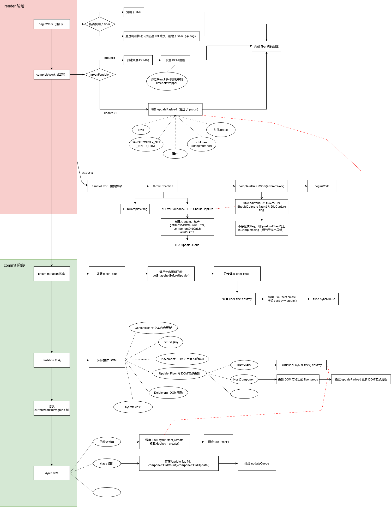

## 版本

- React: 17  

## 参考

[React技术揭秘 - 架构篇](https://react.iamkasong.com/process/reconciler.html)  
[ReactFiber节点的更新入口：beginWork](https://www.neroht.com/article-detail/23)  
[完全理解React的completeWork](https://www.neroht.com/article-detail/26)  
[React源码 commit阶段详解](https://www.neroht.com/article-detail/32)  


## 前言

React Fiber 是 React 维护组件树的一整套机制，分为 `render` 阶段与 `commit` 阶段。  

`render` 阶段是可中断的，借助了 `Scheduler` 包实现分时间片运行，会利用 `current` 树与 JSX 创建 `workInProgress` 树。  

`commit` 阶段是同步的（不可中断），会将 `workInProgress` 树渲染到屏幕上（浏览器上是通过操作 DOM），并实现 `current`/`workInProgress` 树切换。

本文简要分析了 `render` 与 `commit` 阶段的 React 源码。  



## render 阶段

render 阶段主要调用 `performSyncWorkOnRoot`（同步更新） 与 `performConcurrentWorkOnRoot`（异步更新），他们分别会调用 `workLoopSync` 与 `workLoopConcurrent`。  

```js
function workLoopSync() {
  while (workInProgress !== null) {
    performUnitOfWork(workInProgress);
  }
}

function workLoopConcurrent() {
  while (workInProgress !== null && !shouldYield()) {
    performUnitOfWork(workInProgress);
  }
}
```

这两个方法都调用 `performUnitOfWork`，区别在于是否调用 `shouldYield`。`shouldYield` 来自于 React Scheduler 包，用于确定是否应当将控制权归还浏览器。以 `workLoopSync` 为例，其中主流程如下：  

```ts
const SOME_CONDITION = true as any;

type Fiber = {
  sibling: Fiber | null;
  return: Fiber | null;
  child: Fiber | null;
  alternate: Fiber | null; // current 与 workInProgress 互指
};
function beginWork(current: Fiber | null, workInProgress: Fiber) {
  // ...
  return SOME_CONDITION ? null : workInProgress.child;
}
function completeWork(current: Fiber | null, workInProgress: Fiber) {
  return null;
}
function workLoopSync(workInProgress) {
  function loop(workInProgress) {
    // performUnitOfWork:
    const current = workInProgress.alternate;
    let childFiber = beginWork(current, workInProgress); // 返回 null 或 workInProgress.child
    if (childFiber !== null) {
      loop(childFiber);
    }
    // completeUnitOfWork:
    const next = completeWork(current, workInProgress);
    if (next) {
      loop(next);
    }
    const siblingFiber = workInProgress.sibling;
    if (siblingFiber !== null) {
      loop(siblingFiber);
    }
  }

  loop(workInProgress);
}
```

**注意，上述代码为表述清楚使用了递归实现，但源代码是非递归的！** 从中可知这一算法对 Fiber 树做了 **后根遍历**，每一个 fiber 先进行 `beginWork` 再进行 `completeWork`。  


### beginWork

`beginWork` 通过传入当前节点以生成子节点，其中涉及了复用或创建子节点的问题，进一步涉及 diff 算法。下面将 `beginWork` 分为两部分来看。  

```ts
function beginWork(current: Fiber | null, workInProgress: Fiber, renderLanes: Lanes): Fiber | null {
  const updateLanes = workInProgress.lanes;

  // ...
  
  if (current !== null) {
    const oldProps = current.memoizedProps;
    const newProps = workInProgress.pendingProps;

    if (oldProps !== newProps || hasLegacyContextChanged() || /* ... DEV 情况 */) {
      didReceiveUpdate = true;
    } else if (!includesSomeLane(renderLanes, updateLanes)) {
      didReceiveUpdate = false;
      switch (workInProgress.tag) {
        case HostRoot: // ...
        case HostComponent: // ...
        // ... 其他 case
      }
      // 复用 fiber
      return bailoutOnAlreadyFinishedWork(current, workInProgress, renderLanes);
    } else {
      if ((current.flags & ForceUpdateForLegacySuspense) !== NoFlags) {
        // This is a special case that only exists for legacy mode.
        // See https://github.com/facebook/react/pull/19216.
        didReceiveUpdate = true;
      } else {
        didReceiveUpdate = false;
      }
    }
  } else {
    didReceiveUpdate = false;
  }

  // ... 后半部分
}
```

前半部分简单判断是否需要更新，同时尝试在特定条件下复用 fiber。  

`didReceiveUpdate` 标记了是否需要更新 fiber，可见当满足下列条件之一时需要更新：  

- 前后两次 props 不相同（浅比较）  
- context 发生改变  

当不需要更新且满足当前 fiber 优先级不够时，调用 `bailoutOnAlreadyFinishedWork` 复用 fiber，这一方法在该 fiber 及其子 fiber 没有 pending work 时返回 null，对应于 `workLoopSync` 可以不用继续向下遍历子树，做了 **剪枝** 操作。  

```ts
function beginWork(current: Fiber | null, workInProgress: Fiber, renderLanes: Lanes): Fiber | null {
  // ... 前半部分
  
  workInProgress.lanes = NoLanes;
  switch (workInProgress.tag) {
    case IndeterminateComponent: // ...
    case LazyComponent: // ...
    case FunctionComponent: {
      const Component = workInProgress.type;
      const unresolvedProps = workInProgress.pendingProps;
      const resolvedProps =
        workInProgress.elementType === Component
          ? unresolvedProps
          : resolveDefaultProps(Component, unresolvedProps);
      return updateFunctionComponent(
        current,
        workInProgress,
        Component,
        resolvedProps,
        renderLanes,
      );
    }
    case ClassComponent: {
      const Component = workInProgress.type;
      const unresolvedProps = workInProgress.pendingProps;
      const resolvedProps =
        workInProgress.elementType === Component
          ? unresolvedProps
          : resolveDefaultProps(Component, unresolvedProps);
      return updateClassComponent(
        current,
        workInProgress,
        Component,
        resolvedProps,
        renderLanes,
      );
    }
    // ... 其他 case
  }
  // ...
}
```

后半部分根据 tag 生成子 fiber。这里以 `FunctionComponent`（函数组件）为例，其调用了 `updateFunctionComponent`。

```ts
function updateFunctionComponent(current, workInProgress, Component, nextProps: any, renderLanes) {
  // ...
  let context;
  // ...

  let nextChildren;
  prepareToReadContext(workInProgress, renderLanes);
  // ...
  nextChildren = renderWithHooks(current, workInProgress, Component, nextProps, context, renderLanes);

  if (current !== null && !didReceiveUpdate) {
    bailoutHooks(current, workInProgress, renderLanes);
    return bailoutOnAlreadyFinishedWork(current, workInProgress, renderLanes);
  }

  // React DevTools reads this flag.
  workInProgress.flags |= PerformedWork;
  reconcileChildren(current, workInProgress, nextChildren, renderLanes);
  return workInProgress.child;
}
```

当 `current` 存在（即此次更新为 update，非 mount），且 `didReceiveUpdate` 为 `true` 时，复用 fiber 与 hook。否则，为此 fiber 打上 `PerformedWork` flag，后调用 `reconcileChildren` 做 diff 算法并打上相关的 flag（此部分在 [Virtual DOM 与 Diff 算法简析](/blog/vdom-diff#data-react-中的-fiber-diff-算法) 中已阐述）。  

`beginWork` 完成后，这一节点对应的 fiber 子树被生成，其中的节点可能是新创建的，也可能是复用的。同时，各 fiber 节点可能存在 `flag` 用于标记他们需要被移动、创建、删除等信息。  

### completeWork

`completeWork` 完成根据 fiber 创建 DOM 树或对 实际 DOM 进行预处理（实际上这个说法是不准确的，因为 react 不止是针对浏览器，只是考虑使用 `react-dom` 这一 render 的情况下，是对 DOM 进行修改）。  

```js
function completeWork(current: Fiber | null, workInProgress: Fiber, renderLanes: Lanes): Fiber | null {
  const newProps = workInProgress.pendingProps;

  switch (workInProgress.tag) {
    // ... 其他 case
    case ContextConsumer:
    case MemoComponent:
      // ...
      return null;
    case ClassComponent: // ...
    case HostRoot: // ...
    case HostComponent: {
      popHostContext(workInProgress);
      const rootContainerInstance = getRootHostContainer();
      const type = workInProgress.type;
      if (current !== null && workInProgress.stateNode != null) {
        /* Update 逻辑 */

        updateHostComponent(current, workInProgress, type, newProps, rootContainerInstance);
        // ... ref 相关
      } else {
        /* Mount 逻辑 */

        // ...
        const currentHostContext = getHostContext();
        const wasHydrated = popHydrationState(workInProgress);
        if (wasHydrated) {
          // ... hydrated 时的情况
        } else {
          const instance = createInstance(type, newProps, rootContainerInstance, currentHostContext, workInProgress);
          appendAllChildren(instance, workInProgress, false, false);
          workInProgress.stateNode = instance;

          if (finalizeInitialChildren(instance, type, newProps, rootContainerInstance, currentHostContext)) {
            markUpdate(workInProgress);
          }
        }

        // ... ref 相关
      }
      // ...
      return null;
    }
    // ... 其他 case
  }
  // ...
}
```

以 `HostComponent` 为例，其以 `current !== null && workInProgress.stateNode != null` 为区分执行逻辑，实际上该条件满足说明 DOM 节点已存在，执行 update 逻辑，否则执行 mount 逻辑。  

#### Mount 逻辑

在 mount 的情况下，  

- `createInstance` 创建 DOM 节点  
- `appendAllChildren` 将所有子节点对应的 DOM 节点插入到自己中（因为 `completeWork` 在回溯阶段，因此孩子节点的逻辑已经执行完成了，DOM 节点必然是存在的）  
- `finalizeInitialChildren` 设置 DOM 上的一些属性，此时会将 [React 事件机制](/blog/react-event-analysis) 中提到的 listenerWrapper 绑定到 rootContainer 上  
- `markUpdate` 会在 fiber 节点 autoFocus 时打上 `Update` flag  

经过上述步骤后，生成了一颗离屏（offscreen）DOM 树。  


#### Update 逻辑

在 update 的情况下，主要调用了 `updateHostComponent`。

```ts
updateHostComponent = function(current: Fiber, workInProgress: Fiber, type: Type, newProps: Props, rootContainerInstance: Container) {
  const oldProps = current.memoizedProps;
  if (oldProps === newProps) {
    return;
  }

  const instance: Instance = workInProgress.stateNode;
  const currentHostContext = getHostContext();
  const updatePayload = prepareUpdate(instance, type, oldProps, newProps, rootContainerInstance, currentHostContext);
  workInProgress.updateQueue = updatePayload;
  if (updatePayload) {
    markUpdate(workInProgress);
  }
};
```

其中主要将 `updatePayload` 挂载到了 `workInProgress.updateQueue` 上，待 `commit` 阶段处理。  

`updatePayload` 是一个形如 `[key1, value1, key2, value2, ...]` 的数组，包含了 props 的更新，包括：

- `style`
- `DANGEROUSLY_SET_INNER_HTML`  
- 事件  
- 为 string 或 number 的 children  
- 其他普通的 prop  

### 收集 effectList

`completeWork` 由 `completeUnitOfWork` 包裹，在 `completeWork` 结束后会为 `returnFiber` 收集 `effectList`。`effectList` 是单链表，其上挂载了自己子树（不包含自己）中需要在 commit 阶段处理 effect （即 `fiber.flags`）的 fiber。  

```js
function completeUnitOfWork(unitOfWork: Fiber): void {
  // ...
  if (
    returnFiber !== null &&
    // Do not append effects to parents if a sibling failed to complete
    (returnFiber.flags & Incomplete) === NoFlags
  ) {
    if (returnFiber.firstEffect === null) {
      returnFiber.firstEffect = completedWork.firstEffect;
    }
    if (completedWork.lastEffect !== null) {
      if (returnFiber.lastEffect !== null) {
        returnFiber.lastEffect.nextEffect = completedWork.firstEffect;
      }
      returnFiber.lastEffect = completedWork.lastEffect;
    }


    const flags = completedWork.flags;

    // Skip both NoWork and PerformedWork tags when creating the effect
    if (flags > PerformedWork) {
      if (returnFiber.lastEffect !== null) {
        returnFiber.lastEffect.nextEffect = completedWork;
      } else {
        returnFiber.firstEffect = completedWork;
      }
      returnFiber.lastEffect = completedWork;
    }
  }
}
```

### 错误处理

当 fiber 处理时发生错误抛出异常时，会被捕获。

```js
do {
  try {
    workLoopSync(); // workLoopConcurrent() 也是如此
    break;
  } catch (thrownValue) {
    handleError(root, thrownValue);
  }
} while (true);
```

`handleError` 中会调用 `throwException`，后再次对 `workInProgress` 调用 `completeUnitOfWork`。  

```js
function handleError(root, thrownValue): void {
  let erroredWork = workInProgress;
  // ...
  throwException(/* ... */);
  completeUnitOfWork(erroredWork);
}
```

在 `throwException` 中：  

- 为出错的 `fiber` 打上 `Incomplete` flag；  
- 沿根查找第一个定义了 `getDerivedStateFromError` 或 `componentDidCatch` 方法的 fiber（即 ErrorBoundary），直到 `HostRoot`（未捕捉错误则向上抛），将这两个方法作为 update 推入 updateQueue；  

```js
function createClassErrorUpdate(fiber: Fiber, errorInfo: CapturedValue<mixed>, lane: Lane): Update<mixed> {
  const update = createUpdate(NoTimestamp, lane);
  update.tag = CaptureUpdate;
  // ...
  update.payload = () => {
    logCapturedError(fiber, errorInfo);
    return getDerivedStateFromError(error);
  };
  // ...
  update.callback = function callback() {
    // ...
    this.componentDidCatch(error, {
      componentStack: stack !== null ? stack : '',
    });
    // ...
  }
  // ...
  return update;
}

function throwException(root: FiberRoot, returnFiber: Fiber, sourceFiber: Fiber, value: mixed, rootRenderLanes: Lanes) {
  // The source fiber did not complete.
  sourceFiber.flags |= Incomplete;
  // Its effect list is no longer valid.
  sourceFiber.firstEffect = sourceFiber.lastEffect = null;
  // ...
  do {
    switch (workInProgress.tag) {
      case HostRoot: {
        // ...
        const update = createRootErrorUpdate(workInProgress, errorInfo, lane);
        enqueueCapturedUpdate(workInProgress, update);
        return;
      }
      case ClassComponent:
        // ...
        if (
          (workInProgress.flags & DidCapture) === NoFlags &&
          (typeof ctor.getDerivedStateFromError === 'function' ||
            (instance !== null &&
              typeof instance.componentDidCatch === 'function' &&
              !isAlreadyFailedLegacyErrorBoundary(instance)))
        ) {
          workInProgress.flags |= ShouldCapture;
          // ...
          // Schedule the error boundary to re-render using updated state
          const update = createClassErrorUpdate(
            workInProgress,
            errorInfo,
            lane,
          );
          enqueueCapturedUpdate(workInProgress, update);
          return;
        }
        break;
      default:
        break;
    }
    workInProgress = workInProgress.return;
  } while (workInProgress !== null);
  // ...
}
```

`throwException` 后走 `completeUnitOfWork` 逻辑，注意到此时 fiber 已经被打上了 `Incomplete` flag，此时会进入 `completeUnitOfWork` 的错误处理逻辑。其中：

- 调用 `unwindWork` 处理错误，其当当前 `fiber` 有 `ShouldCapture` 时（即 ErrorBoundary），将 flag 转为 `DidCapture`，后返回这一 `fiber` 作为下一个 `performUnitOfWork` 对象；  
- 如果没有返回新的 `fiber`，那么为 `returnFiber` 打上 `InComplete`（未捕捉错误则向上抛）；  

```js
function completeUnitOfWork(unitOfWork: Fiber): void {
  // ...
  if ((completedWork.flags & Incomplete) === NoFlags) {
    // ...
  } else {
    const next = unwindWork(completedWork, subtreeRenderLanes);

    // ...

    if (next !== null) {
      // If completing this work spawned new work, do that next. We'll come back here again.
      // Since we're restarting, remove anything that is not a host effect from the effect tag.
      next.flags &= HostEffectMask;
      workInProgress = next;
      return;
    }

    // ...

    if (returnFiber !== null) {
      // Mark the parent fiber as incomplete and clear its effect list.
      returnFiber.firstEffect = returnFiber.lastEffect = null;
      returnFiber.flags |= Incomplete;
    }
  }
  // ...
}

function unwindWork(workInProgress: Fiber, renderLanes: Lanes) {
  switch (workInProgress.tag) {
    case ClassComponent: {
      const Component = workInProgress.type;
      // ...
      const flags = workInProgress.flags;
      if (flags & ShouldCapture) {
        workInProgress.flags = (flags & ~ShouldCapture) | DidCapture;
        // ...
        return workInProgress;
      }
      return null;
    }
    case HostRoot: // ...
    case HostComponent: // ...
    case SuspenseComponent: // ...
    // ... 其他 case
  }
}
```

在 `beginWork` 处理 class 组件时：

- 通过处理 `updateQueue` 以处理 `getDerivedStateFromError`, `componentDidCatch`；  
- 存在 `DidCapture` flag 且 `getDerivedStateFromError` 未定义时，令 `nextChildren` 为 null 以卸载组件树；  

## commit 阶段

commit 阶段从 `commitRoot` 开始。`commitRoot` 通过 Scheduler 包的中的 `runWithPriority` 执行 `commitRootImpl`。其中可按顺序划分为：

- before mutation 阶段：`commitBeforeMutationEffects` 实现；  
- mutation 阶段：`commitMutationEffects` 实现；  
- workInProgress/current 树切换：`root.current = finishedWork` 实现 workInProgress 树转 current 树；  
- layout 阶段：`recursivelyCommitLayoutEffects` 实现；  

### before mutation 阶段

```ts
function commitBeforeMutationEffects() {
  while (nextEffect !== null) {
    const current = nextEffect.alternate;

    if (!shouldFireAfterActiveInstanceBlur && focusedInstanceHandle !== null) {
      // 处理 focus, blur 逻辑
    }

    const flags = nextEffect.flags;
    if ((flags & Snapshot) !== NoFlags) {
      // ...
      // 调用 `getSnapshotBeforeUpdate`
      commitBeforeMutationEffectOnFiber(current, nextEffect);
      // ...
    }
    if ((flags & Passive) !== NoFlags) {
      // If there are passive effects, schedule a callback to flush at
      // the earliest opportunity.
      if (!rootDoesHavePassiveEffects) {
        rootDoesHavePassiveEffects = true;
        scheduleCallback(NormalSchedulerPriority, () => {
          flushPassiveEffects();
          return null;
        });
      }
    }
    nextEffect = nextEffect.nextEffect;
  }
}
```

`commitBeforeMutationEffects` 方法中主要做了三件事情：

- 处理 `focus`, `blur` 相关逻辑  
- 调用生命周期函数 `getSnapshotBeforeUpdate`  
- 异步调度 `useEffect`    

#### 调用 `getSnapshotBeforeUpdate`

在 `commitBeforeMutationLifeCycles`（`commitBeforeMutationEffectOnFiber` 的别名）中，当 fiber 为 `ClassComponent` 且有 `Snapshot` flag 时，会调用 `getSnapshotBeforeUpdate(...)` 生命周期函数。  

#### 处理 `useEffect`

`flushPassiveEffects` 负责处理 `useEffect`，其在 before mutation 中通过 `scheduleCallback` 异步调度。

`flushPassiveEffects` 会间接按顺序调用下列方法：

- `flushPassiveUnmountEffects`：对 fiber, fiber.deletions 以后根遍历顺序处理 effect list 中有 `HookPassive`, `HookHasEffect` 的 effect 的 `destroy` 方法；   
- `flushPassiveMountEffects`：对 fiber 以后根遍历顺序处理 effect list 中有 `HookPassive`, `HookHasEffect` 的 effect，调用 `create` 方法，并将返回值挂载在 `destroy` 上（这与 `useEffect` API 用法一致）；
- `flushSyncCallbackQueue`：由 `runWithPriority` 方法包裹，同步清除 syncQueue 中的 callback；

### mutation 阶段

mutation 阶段由 `commitMutationEffects` 实现，其处理 fiber.deletions 后以后根遍历顺序调用 `commitMutationEffectsImpl` 处理 fiber。

```js
function commitMutationEffects(
  root: FiberRoot,
  renderPriorityLevel: ReactPriorityLevel,
) {
  // TODO: Should probably move the bulk of this function to commitWork.
  while (nextEffect !== null) {
    // ...

    const flags = nextEffect.flags;

    if (flags & ContentReset) {
      commitResetTextContent(nextEffect);
    }

    if (flags & Ref) {
      const current = nextEffect.alternate;
      if (current !== null) {
        commitDetachRef(current);
      }
      // ...
    }

    const primaryFlags = flags & (Placement | Update | Deletion | Hydrating);
    switch (primaryFlags) {
      case Placement: {
        commitPlacement(nextEffect);
        nextEffect.flags &= ~Placement;
        break;
      }
      case PlacementAndUpdate: {
        // Placement
        commitPlacement(nextEffect);
        nextEffect.flags &= ~Placement;

        // Update
        const current = nextEffect.alternate;
        commitWork(current, nextEffect);
        break;
      }
      // hydrate 相关
      case Update: {
        const current = nextEffect.alternate;
        commitWork(current, nextEffect);
        break;
      }
      case Deletion: {
        commitDeletion(root, nextEffect, renderPriorityLevel);
        break;
      }
    }

    // ...
    nextEffect = nextEffect.nextEffect;
  }
}
```

`commitMutationEffectsImpl` 处理内容包括：

- 文本内容更新：`commitResetTextContent`；
- ref 解除：`commitDetachRef` 将 `current.ref` 设为 null；  
- DOM 节点插入或移动：`commitPlacement`；  
- DOM 节点更新：`commitWork`；
- DOM 节点删除：`commitDeletion` 将自己从父元素中删除；  
- hydrate 相关；  

#### `commitPlacement`

`commitPlacement` 负责 Fiber 节点对应的 DOM 节点的插入或移动。

```ts
function commitPlacement(finishedWork: Fiber): void {
  // ...
  const parentFiber = getHostParentFiber(finishedWork);
  let parent;
  let isContainer;
  // ...
  if (parentFiber.flags & ContentReset) {
    resetTextContent(parent);
    parentFiber.flags &= ~ContentReset;
  }

  const before = getHostSibling(finishedWork);
  // ...
  insertOrAppendPlacementNodeIntoContainer(finishedWork, before, parent);
  // ...
}

function getHostSibling(fiber: Fiber): ?Instance {
  // We're going to search forward into the tree until we find a sibling host
  // node. Unfortunately, if multiple insertions are done in a row we have to
  // search past them. This leads to exponential search for the next sibling.
  // TODO: Find a more efficient way to do this.
  let node: Fiber = fiber;
  siblings: while (true) {
    while (node.sibling === null) {
      if (node.return === null || isHostParent(node.return)) {
        return null;
      }
      node = node.return;
    }
    node.sibling.return = node.return;
    node = node.sibling;
    while (node.tag !== HostComponent && node.tag !== HostText && node.tag !== DehydratedFragment) {
      if (node.flags & Placement) {
        continue siblings;
      }
      if (node.child === null || node.tag === HostPortal) {
        continue siblings;
      } else {
        node.child.return = node;
        node = node.child;
      }
    }
    if (!(node.flags & Placement)) {
      return node.stateNode;
    }
  }
}
```

其中，

- `getHostParentFiber`：找到 fiber 对应的可以作为 DOM 节点对应的 fiber，后将对应的 container 或 DOM 节点赋值给 `parent`；  
- `getHostSibling`：找到 fiber 的兄弟节点对应的 DOM 节点。由于 fiber 树与 DOM 树不对应（fiber 树中存在非 `HostComponent`, `HostText` 等节点），本算法每次执行的复杂度都为 $O(n)$，并且很可能跨层查找，效率不高。在本算法中，需要在不断的向上（沿根）、向右（沿兄弟）、向下（沿孩子）的步骤中找到固定的（没有 `Placement` flag）符合条件的 `fiber`，如果找不到则返回 `null`；  
- `insertOrAppendPlacementNodeIntoContainer`/`insertOrAppendPlacementNode`：根绝 `before` 是否 null 决定使用 `insertBefore` 或 `appendChild` API；  


#### `commitWork`

`commitWork` 负责 fiber 节点与实际 DOM 节点的更新。

```ts
function commitWork(current: Fiber | null, finishedWork: Fiber): void {
  // ...
  switch (finishedWork.tag) {
    case FunctionComponent:
    case ForwardRef:
    case MemoComponent:
    case SimpleMemoComponent:
    case Block: {
      // ...
      commitHookEffectListUnmount(HookLayout | HookHasEffect, finishedWork, finishedWork.return);
      return;
    }
    case ClassComponent:  // ...
    case HostComponent: {
      const instance: Instance = finishedWork.stateNode;
      if (instance != null) {
        const newProps = finishedWork.memoizedProps;
        const oldProps = current !== null ? current.memoizedProps : newProps;
        const type = finishedWork.type;
        const updatePayload: null | UpdatePayload = finishedWork.updateQueue;
        finishedWork.updateQueue = null;
        if (updatePayload !== null) {
          commitUpdate(instance, updatePayload, type, oldProps, newProps, finishedWork);
        }
      }
      return;
    }
    case HostText: {
      // ...
      const textInstance: TextInstance = finishedWork.stateNode;
      const newText: string = finishedWork.memoizedProps;
      const oldText: string = current !== null ? current.memoizedProps : newText;
      commitTextUpdate(textInstance, oldText, newText);
      return;
    }
    case HostRoot: {
      // ... hydrate 相关
      return;
    }
    // ... 其他 case
  }
  // ...
}
```

其中，

- 对函数组件等：通过 `commitHookEffectListUnmount(HookLayout | HookHasEffect, ...)` 处理 `useLayoutEffect` effect 的 destroy
- 对 HostComponent：通过 `commitUpdate(...)` 更新 DOM 节点上的 fiber props 信息，并根据 render 阶段的 completeWork 中在 update 时创建的 updatePayload 更新 DOM 节点上的相关信息，如 `style`, `innerHTML` 等  
- ...

### layout 阶段

`layout` 阶段由 `recursivelyCommitLayoutEffects` 实现。

```js
function commitLayoutEffects(root: FiberRoot, committedLanes: Lanes) {
  // ...
  while (nextEffect !== null) {
    // ...
    const flags = nextEffect.flags;
    if (flags & (Update | Callback)) {
      const current = nextEffect.alternate;
      commitLayoutEffectOnFiber(root, current, nextEffect, committedLanes);
    }

    // ...
    if (flags & Ref) {
      commitAttachRef(nextEffect);
    }

    // ...
    nextEffect = nextEffect.nextEffect;
  }
  // ...
}

function commitLifeCycles(
  finishedRoot: FiberRoot,
  current: Fiber | null,
  finishedWork: Fiber,
  committedLanes: Lanes,
): void {
  switch (finishedWork.tag) {
    case FunctionComponent:
    case ForwardRef:
    case SimpleMemoComponent:
    case Block: {
      // ...
      commitHookEffectListMount(HookLayout | HookHasEffect, finishedWork);
      // ...
      schedulePassiveEffects(finishedWork);
      return;
    }
    case ClassComponent: {
      const instance = finishedWork.stateNode;
      if (finishedWork.flags & Update) {
        if (current === null) {
          // ...
          instance.componentDidMount();
        } else {
          const prevProps =
            finishedWork.elementType === finishedWork.type
              ? current.memoizedProps
              : resolveDefaultProps(finishedWork.type, current.memoizedProps);
          const prevState = current.memoizedState;
          // ...
          instance.componentDidUpdate(prevProps, prevState, instance.__reactInternalSnapshotBeforeUpdate);
        }
      }
      // ...
      const updateQueue = finishedWork.updateQueue;
      if (updateQueue !== null) {
        // ...
        commitUpdateQueue(finishedWork, updateQueue, instance);
      }
      return;
    }
    // ... 其他 case
  }
  // ...
}
```

在 `commitLayoutEffectOnFiber`(`commitLifeCycles`) 中，区分组件类型执行操作：

- 函数组件等：  
  - 调用 `useLayoutEffect`，通过 `commitHookEffectListMount(HookLayout | HookHasEffect, ...)`；  
  - 异步调度还未调度的 `useEffect`；  
- class 组件：  
  - 当有 `Update` flag 时，调用 `componentDidMount`/`componentDidUpdate`；  
  - 处理 updateQueue 中的 effect；
- `HostRoot`：  
  - 处理 updateQueue 中的 effect；  
- `HostComponent`：  
  - 当处于 mount 逻辑且存在 `Update` flag 时，处理 autoFocus 逻辑；  

另外，当存在 `Ref` flag 时会将 `ref.current` 设置为这一 DOM 节点（通过 `commitAttachRef`）。

