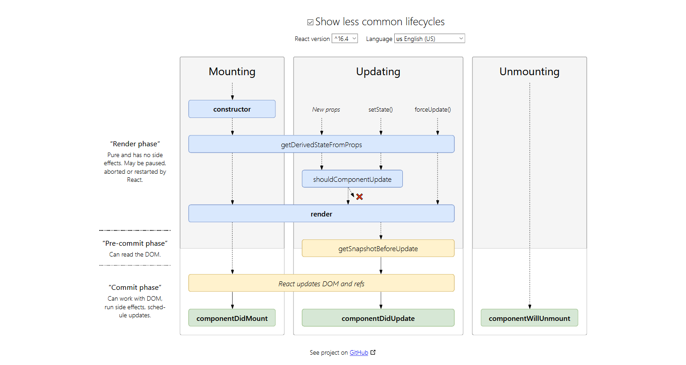

## 概述

### 生命周期图谱

React 16.4 及以后的生命周期图谱如图。



### 挂载阶段

- `constructor()`
- `static getDerivedStateFromProps()`
- `render()`
- `componentDidMount()`

### 更新阶段

- `static getDerivedStateFromProps()`
- `shouldComponentUpdate()`
- `render()`
- `getSnapshotBeforeUpdate()`
- `componentDidUpdate()`

### 卸载阶段

- `componentWillUnmount()`

### 错误处理

- `static getDerivedStateFromError()`
- `componentDidCatch()`

## 一个Demo

<iframe height="500" style="width: 100%;" scrolling="no" title="React 16.4 Lifecycle Simple Demo" src="https://codepen.io/hpp2334/embed/oNjPazp?height=265&theme-id=light&default-tab=js,result" frameborder="no" allowtransparency="true" allowfullscreen="true">
  See the Pen <a href='https://codepen.io/hpp2334/pen/oNjPazp'>React 16.4 Lifecycle Simple Demo</a> by hpp2334
  (<a href='https://codepen.io/hpp2334'>@hpp2334</a>) on <a href='https://codepen.io'>CodePen</a>.
</iframe>

<Collapse title="代码段">

```html
<div id="app"></div>
<div id="innerLifeCycleDiv" style="white-space: pre-wrap; margin: 20px; padding: 20px; border: 1px solid #111"></div>
```

```jsx
const _nd = document.getElementById('innerLifeCycleDiv');
const _innerLifeCycle = [];
const innerLifeCycle = new Proxy(_innerLifeCycle, {
  get: function (target, propKey) {
    if (propKey === 'push' || propKey === 'shift') {
      return (...args) => {
        const x = target[propKey](args);
        _nd.innerHTML = target.join('\n');
        return x;
      }
    } else {
      return target[propKey];
    }
  }
});

class Inner extends React.Component {
  constructor() {
    super();
    innerLifeCycle.push("constructor()");
    this.state = {
      count: 0,
    };
    
    this.updateCount = this.updateCount.bind(this);
    this.fnForceUpdate = this.fnForceUpdate.bind(this);
  }

  static getDerivedStateFromProps() {
    innerLifeCycle.push("getDerivedStateFromProps()");
  }

  componentDidMount() {
    innerLifeCycle.push("componentDidMount()");
  }

  shouldComponentUpdate() {
    innerLifeCycle.push("shouldComponentUpdate()");
    return true;
  }

  getSnapshotBeforeUpdate() {
    innerLifeCycle.push("getSnapshotBeforeUpdate()");
  }

  componentDidUpdate() {
    innerLifeCycle.push("componentDidUpdate()");
  }

  componentWillUnmount() {
    innerLifeCycle.push("componentWillUnmount()");
  }
  
  updateCount () {
    while (innerLifeCycle.shift());
    this.setState((state, prop) => ({
      count: state.count + 1,
    }));
  }
  
  fnForceUpdate () {
    while (innerLifeCycle.shift());
    this.forceUpdate();
  }

  render() {
    innerLifeCycle.push("render()");
    return (
      <div>
        <span>Inner Controller: </span>
        <button onClick={this.updateCount}>Update Inner State</button>
        <button onClick={this.fnForceUpdate}>Force Update</button>
      </div>
    );
  }
}

class App extends React.Component {
  constructor() {
    super();
    this.state = {
      isInnerMount: true,
      outterCount: 0,
    };
    
    this.switchMount = this.switchMount.bind(this);
    this.updateInnerProps = this.updateInnerProps.bind(this);
  }
  
  switchMount () {
    while (innerLifeCycle.shift());
    this.setState((state, props) => ({
      isInnerMount: !state.isInnerMount,
    }));
  }
  
  updateInnerProps () {
    while (innerLifeCycle.shift());
    this.setState((state, props) => ({
      outterCount: state.outterCount + 1,
    }));
  }

  render() {
    return (
      <div>
        <p>The following content shows the lifeCycle of component 'Inner'.</p>
        <span>App Controller: </span>
        <button onClick={this.switchMount}>Switch Mount</button>
        <button onClick={this.updateInnerProps}>Update Inner Props</button>
        {this.state.isInnerMount && <Inner outterCount={this.state.outterCount} />}
      </div>
    );
  }
}

ReactDOM.render(<App />, document.getElementById("app"));
```
</Collapse>

## 生命周期方法

### `render()`

是class组件中唯一必须实现的方法，当被调用时，会检查`this.props`与`this.state`的变化并返回

- React元素
- 数组
- fragments
- Portals
- 字符串或数值（会被渲染为文本节点）
- 布尔类型或null，什么都不渲染（主要是为了支持`test && <A />`之类的形式）

`render()`应为纯函数

### `constructor()`

一般仅用于实现：

- 通过对`this.state`赋值初始化内部state
- 为事件处理函数绑定实例（`this.func = this.func.bind(this)`）

### `componentDidMount()`

依赖于DOM节点的初始化的部分在此处实现，如网络请求等

### `componentDidUpdate(prevProps, prevState, snapshot)`

组件更新后，可通过`prevProps`, `prevState`等进行网络请求等

`snapshot`参数若在实现`getSnapshotBeforeUpdate()`的情况下为其返回值，否则为`undefined`

### `shouldComponentUpdate(nextProps, nextState)`

其返回值决定生命周期图谱中`new Props`与`setState`引发的更新阶段中`render`以后是否执行，返回`false`不会阻止子组件在state更改时重新渲染。

此方法主要用于**性能优化**。

### `static getDerivedStateFromProps(props, state)`

此方法让组件在props变化时更新state。其返回一个对象来更新`state`，若返回`null`则不更新。

### `getSnapshotBeforeUpdate(prevProps, prevState)`

此方法让组件发生更改之前从DOM中捕获一些信息。

### `static getDerivedStateFromError(error)`

此生命周期会在后代组件抛出错误后调用。
