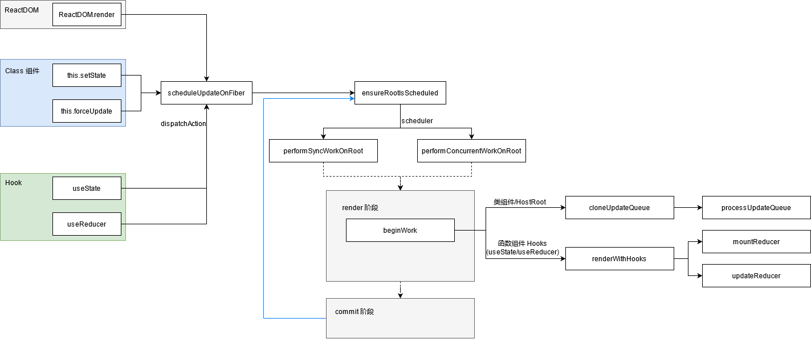

## 参考

- [React 技术揭秘 - 第六章 状态更新](https://react.iamkasong.com/state/prepare.html)  
- [10.scheduler&lane模型(来看看react是暂停、继续和插队的)](https://xiaochen1024.com/article_item/600acd54245877002ed5df04)  

## 大体流程



## 数据结构

### Fiber

`Fiber` 与状态更新有关的属性为：  

```ts
export type Fiber = {
  flags: Flags,
  updateQueue: mixed,
  memoizedState: any,
  lanes: Lanes,
}
```

### Update 与 UpdateQueue (在 HostRoot, ClassComponent 使用)

`Update` 描述了更新的结构：

```ts
export const UpdateState = 0;
export const ReplaceState = 1;
export const ForceUpdate = 2;
export const CaptureUpdate = 3;

export type Update<State> = {
  eventTime: number,
  lane: Lane,                     // 优先级
  tag: 0 | 1 | 2 | 3,             // 类型，有 UpdateState, ReplaceState, ForceUpdate, CaptureUpdate
  payload: any,                   // 更新内容
  callback: (() => mixed) | null, // callback
  next: Update<State> | null,     // 指向下一个 Update
};
```

`UpdateQueue` 存储了 `Update`：

```ts
export type UpdateQueue<State> = {
  // 更新前的 state
  baseState: State,
  // 触发更新前已有 Update 组成的单链表，firstBaseUpdate 为头，lastBaseUpdate 为尾
  firstBaseUpdate: Update<State> | null,
  lastBaseUpdate: Update<State> | null,
  shared: {
    // 触发更新时 Update 组成的循环链表
    pending: Update<State> | null,
  },
  // 保存 callback 非空的 Update
  effects: Array<Update<State>> | null,
};
```

此处触发更新前会有 Update 是因为更新时会跳过低优先级 Update，详见 核心 API 中的 `ensureRootIsScheduled`。

### Update 与 UpdateQueue （Hook）

Hook 中的 Hook, Update, UpdateQueue 与 类组件中的类似。

```ts
export type Hook = {
  memoizedState: any,
  baseState: any,                              // 类似于类组件中的 UpdateQueue.baseState
  baseQueue: Update<any, any> | null,          // 类似于类组件中的 UpdateQueue.firstBaseUpdate 与 UpdateQueue.lastBaseUpdate
  queue: UpdateQueue<any, any> | null,         // updateQueue
  next: Hook | null,
};

type Update<S, A> = {
  lane: Lane,                                  // 优先级
  action: A,                                   // action
  eagerReducer: ((S, A) => S) | null,          // dispatchAction 时保存的 queue.lastRenderedReducer
  eagerState: S | null,                        // dispatchAction 时根据 eagerReducer, queue.lastRenderedState, action 提前计算的 state
  next: Update<S, A>,                          // next 指针，为环状链表
  priority?: ReactPriorityLevel,
};

type UpdateQueue<S, A> = {
  pending: Update<S, A> | null,                // update 链表
  dispatch: (A => mixed) | null,               // useState, useReducer 返回的 dispatch
  lastRenderedReducer: ((S, A) => S) | null,   // 最后一次 mountReducer/updateReducer 的 reducer
  lastRenderedState: S | null,                 // 最后一次 mountReducer/updateReducer 的 state
};
```

## 处理 updateQueue （类组件与 HostRoot）

类组件处理 updateQueue 发生在 render 阶段的 beginWork 中。 

### cloneUpdateQueue

处理 updateQueue 前，若 current 与 workInProgress 的 updateQueue 引用相同，则会进行浅拷贝。

### processUpdateQueue

`processUpdateQueue` 负责处理 updateQueue，其中核心流程为：  

1. 将 `shared.pending` 转为单链表并同时接到 current 与 workInProgress 的 `baseQueue` 后，并清空原 `shared.pending` 引用；  
2. 遍历 `baseQueue`，维护新的 updateQueue：  
  - `baseState`：直到第一个不满足优先级的 update 为止，通过处理满足优先级的 update 调用 `getStateFromUpdate` 计算得到的新的 state；  
  - `effects`：处理满足优先级的 update 后，根据 `update.callback` 维护；  
  - `firstBaseUpdate`, `lastBaseUpdate`：由 第一个不满足优先级的 Update **与其后的** Update 组成；  
3. 当 `baseQueue` 遍历完成后，会检测 `shared.pending` 是否为空，若非空则会重复步骤 1, 2；  
4. 维护 workInProgress fiber 相关属性  
  - `lanes`：将不满足优先级的 update 通过 `mergeLanes` 得到的 lane;  
  - `memoizedState`：通过处理所有满足优先级的 update 计算得到的新的 state；

需要注意：

1. 步骤 1 中 “同时接到 current 与 workInProgress 的 `baseQueue` 后” 是为了防止中断后造成 update 丢失；  
2. `workInProgress.memoizedState` 与 `updateQueue.baseState` 相比，没有 “遇到第一个不满足优先级的 update” 的限制。因为 `baseState` 是计算新 state 的基础，新 state 通过 `firstBaseUpdate` 与 `lastBaseUpdate` 组成的链表构成。而 `memoizedState` 是 fiber 计算得到的 state；  
3. `baseQueue` 遍历过程中，`shared.pending` 可能会由于 update 内部触发更新而导致非空，这是需要进行步骤 3 的原因；  

## 处理 updateQueue （函数组件 Hook）

函数组件的 `useState`/`useReducer` 处理 updateQueue 发生在 render 阶段的 beginWork 中，由 `renderWithHooks` 调用 `mountReducer`/`updateReducer`。  

### mountReducer

初始化：  

- `hook.memoizedState`, `hook.baseState`  
- `hook.queue`
- `dispatch`

返回 `[hook.memoizedState, dispatch]`

### updateReducer

与类组件的 `processUpdateQueue` 类似：

- 合并 workInProgress 的 hook 的 `baseQueue` 与 `queue.pending` 组成新的环状链表，并设置在 current 的 hook 的 `baseQueue` 上；  
- 遍历合并后的 updateQueue，同样考虑 lane 并维护 `hook.baseState`, `hook.baseQueue`, `queue.lastRenderedState`

与类组件的 `processUpdateQueue` 不同的是：  

- 若满足 `update.eagerReducer === reducer`，会直接采用在 `dispatchAction` 中计算得到的 `eagerState`（因此连续执行 `setState(prev => ...)` 时 `prev` 是一致的），否则会基于计算时的 `newState` 与传入的 `reducer` 计算 `reducer(newState, update.action)`


## 核心 API

### scheduleUpdateOnFiber

为当前 fiber 调度一次更新。具体流程为：  

- `markUpdateLaneFromFiberToRoot`：从当前 fiber 到根更新 lane，并返回 fiber root；  
- 调用 `ensureRootIsScheduled` 以确保 fiber root 被调度 （实际上会有优化，如当为 `SyncLane` 且不在 render 或 commit 阶段时直接执行 `performSyncWorkOnRoot`）；  

```ts
export function scheduleUpdateOnFiber(
  fiber: Fiber,
  lane: Lane,
  eventTime: number,
) {
  checkForNestedUpdates();
  warnAboutRenderPhaseUpdatesInDEV(fiber);

  const root = markUpdateLaneFromFiberToRoot(fiber, lane);
  if (root === null) {
    // ...
    return null;
  }

  // 标记 root 有 pending update
  markRootUpdated(root, lane, eventTime);

  // ...

  const priorityLevel = getCurrentPriorityLevel();

  if (lane === SyncLane) {
    if (
      (executionContext & LegacyUnbatchedContext) !== NoContext &&
      (executionContext & (RenderContext | CommitContext)) === NoContext
    ) {
      schedulePendingInteractions(root, lane);
      // unbatched 且不在渲染时则不通过 scheduler 直接调度
      performSyncWorkOnRoot(root);
    } else {
      ensureRootIsScheduled(root, eventTime);
      schedulePendingInteractions(root, lane);
      if (executionContext === NoContext) {
        resetRenderTimer();
        flushSyncCallbackQueue();
      }
    }
  } else {
    if (
      (executionContext & DiscreteEventContext) !== NoContext &&
      // Only updates at user-blocking priority or greater are considered
      // discrete, even inside a discrete event.
      (priorityLevel === UserBlockingSchedulerPriority ||
        priorityLevel === ImmediateSchedulerPriority)
    ) {
      // 维护 rootsWithPendingDiscreteUpdates
      // ...
    }
    ensureRootIsScheduled(root, eventTime);
    schedulePendingInteractions(root, lane);
  }

  // ...
}
```

### ensureRootIsScheduled

此 API 确保 fiber root 被调度：  

- 获取优先级（lanePriority）；  
- 若已存在不同优先级的调度任务，说明有任务正在进行，将其取消（此处存在不同优先级的调度任务意味着此次优先级更高）；  
- 通过 scheduler 调度 `performSyncWorkOnRoot`/`performConcurrentWorkOnRoot`；  

```ts
function ensureRootIsScheduled(root: FiberRoot, currentTime: number) {
  const existingCallbackNode = root.callbackNode;

  // 防饥饿
  markStarvedLanesAsExpired(root, currentTime);

  // 下一次渲染使用的 lanes
  const nextLanes = getNextLanes(
    root,
    root === workInProgressRoot ? workInProgressRootRenderLanes : NoLanes,
  );
  // 即 return_highestLanePriority
  const newCallbackPriority = returnNextLanesPriority();

  // ...

  // 当前存在调度任务
  if (existingCallbackNode !== null) {
    const existingCallbackPriority = root.callbackPriority;
    // 优先级不变时，复用调度，直接退出
    if (existingCallbackPriority === newCallbackPriority) {
      return;
    }
    // 优先级改变时，取消现有调度
    cancelCallback(existingCallbackNode);
  }

  // 调度新任务
  let newCallbackNode;
  if (newCallbackPriority === SyncLanePriority) {
    newCallbackNode = scheduleSyncCallback(
      performSyncWorkOnRoot.bind(null, root),
    );
  } else if (newCallbackPriority === SyncBatchedLanePriority) {
    newCallbackNode = scheduleCallback(
      ImmediateSchedulerPriority,
      performSyncWorkOnRoot.bind(null, root),
    );
  } else {
    const schedulerPriorityLevel = lanePriorityToSchedulerPriority(
      newCallbackPriority,
    );
    newCallbackNode = scheduleCallback(
      schedulerPriorityLevel,
      performConcurrentWorkOnRoot.bind(null, root),
    );
  }

  root.callbackPriority = newCallbackPriority;
  root.callbackNode = newCallbackNode;
}
```

在 commit 阶段的最后，会再次调用此 API 已确保所有的任务都被调度（如之前取消过任务，可能会在此次调用中被重新处理）。  

## 状态更新相关 API

- `ReactDOM.render`  
- `this.setState`  
- `this.forceUpdate`  
- `useState`  
- `useReducer`  

上述 API 都会创建 Update 对象并调用 `scheduleUpdateOnFiber`。

另外，可以了解到：  

- 类组件的 API `this.setState`, `this.forceUpdate` 实际上是调用 updater `classComponentUpdater`，其在 render 阶段的 beginWork 中注入；  
- Hook `useState` 实际上即 reducer 为 `basicStateReducer` 的 `useReducer`，它们返回的数组中的第二项实际上为 `dispatchAction`；  
- 上述 API 通过 `requestUpdateLane` 得到创建 update 以及调用 `scheduleUpdateOnFiber` 时使用的 lane；  

### dispatchAction (Hook)

`useState`/`useReducer` 返回的数组的第二项为 `dispatch`，会间接调用 `dispatchAction`。`dispatchAction` 中会生成 update 对象并维护 `queue.pending`。需要注意，update 对象中的 `eagerReducer` 与 `eagerState` 的维护是基于 `queue.lastRenderedReducer` 与 `queue.lastRenderedState` 计算的，因此在一次 update 中调用 dispatch 时的 state 都是相同的。  


## 优先级（WIP）

### requestUpdateLane (WIP)

目前对于 legacy 模式，均返回 `SyncLane`。目前 React 18 正在稳定的路上，待后续学习新的 API 与模式后再补充 QAQ  

## 其他

### this.setState 的同步与异步问题（legacy 模式）

`this.setState` 会调用 `requestUpdateLane` -> `scheduleUpdateOnFiber`，首先明确：  

- legacy 模式下 `requestUpdateLane` 均获得 `SyncLane`  

以下分情况讨论：  

- 原生事件、setTimeout 等：`scheduleUpdateOnFiber` 中 executionContext 为 `NoContext` 下，因此调用 `ensureRootIsScheduled` 并调用 `flushSyncCallbackQueue`，后调用 `performSyncWorkOnRoot`，因而 render 阶段被同步执行，`processUpdateQueue` 此时处理完成新的 state，因此表现为 同步；  
- 生命周期方法：与原生事件相比，区别在于 `executionContext` 不为 null，因此不会在本次宏任务中执行 `performSyncWorkOnRoot`，表现为 异步；  
- React 事件方法：`executionContext` 至少会被打上 `EventContext`，因此同理表现为 异步；  

