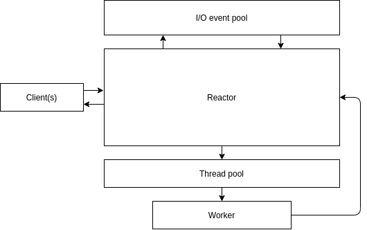

import {
ReactorPatternTcpEchoServerCode
} from "./reactor-patter-code"

## 概述

Reactor 模式属于事件驱动模型，通过 I/O 多路复用的方式，允许创建少量的线程即可处理大量的请求。

## Reactor 的线程池模式

### 组成与职能

下图为 Reactor 线程池模式的组成与职能。



I/O 池是操作系统提供的 I/O 机制或对应的封装，这里的 I/O 机制如 Linux 下的 epoll, AIO, io_uring，Mac 下的 kqueue，Windows 下的 IOPC。

线程池用于处理非 I/O 任务。这一模式下使用线程池处理非 I/O 任务，可以避免因 Reactor 处理了耗时的非 I/O 任务，而导致延迟了对后续 I/O 任务的处理，有助于提升性能。

Reactor 是单线程的，负责处理 I/O 操作与调度非 I/O 任务。具体的:

- 向 I/O 池注册连接建立、连接数据可读事件；
- 通过事件循环获取 I/O 池返回的事件，从 I/O 源（如 socket 等，下称 “源”）中读取数据，向 I/O 源中写入数据等；
- 将从 I/O 源中读取的数据等封装为任务，后将其交给线程池处理；

### 工作流程

以下以 TCP 客户端发起连接、发送数据、接收数据的，阐述 Reactor 线程池模式下的工作流程：

1. (server) 服务端 Reactor 创建服务器，向 I/O 池注册通知连接事件，并开启事件循环。此事件循环指 Reactor 拉取 I/O 池事件列表，若无事件则保持阻塞，有事件则结束阻塞，Reactor 会逐一处理事件，全部处理后再次拉取事件，保持循环；
2. (client) 客户端发起连接；
3. (server) I/O 池结束阻塞，Reactor 通过遍历事件列表，接受来自客户端的连接并监听读写事件；
4. (client) 客户端发送数据；
5. (server) I/O 池结束阻塞，Reactor 遍历到这一事件时，通过循环读取读出数据；
6. (server) Reactor 将数据发送给线程池进行处理，线程池会交给某一线程处理；
7. (server) 线程处理结束后，将计算结果回写到 Reactor 预留的空间中，唤起 Reactor 中的事件循环；
8. (server) Reactor 在某次事件循环中读取计算结果，并写入到对应连接中；
9. (client) 客户端接收数据；

## Reactor 的其他模式

### 单线程模式

对比于线程池模式，单线程模式不使用线程池，Reactor 同时处理 I/O 与非 I/O 任务，性能相对较低。

### 多 Reactor 模式

对比于线程池模式，这一模式将 Reactor 进一步分为了一个 mainReactor 与多个 subReactor:

- mainReactor: 只处理连接建立，并将这一连接交给某一 subReactor；
- subReactor: 维护各自的 I/O 池，负责处理 I/O 源读写数据；

这一模式解决了线程池模式下 Reactor 可能成为性能瓶颈的问题。

## Reactor 的优缺点

优点：

- 对比于基于线程架构，只需要创建少量线程即可处理大量请求，避免了线程创建与切换带来的性能损耗；

缺点：

- 如果处理的任务耗时大，会对后续任务的处理造成延迟；

总的来说，Reactor 适用于 I/O 密集型任务。

## 基于 Rust 实现 TCP echo server

本部分基于 Rust 实现 Reactor 线程池模式下的 TCP echo server Demo。

### Reactor 数据结构

```rust
struct Reactor {
    // tcp server
    server: TcpListener,
    // I/O 池
    poll: Poll,
    // I/O 池唤醒器
    poll_waker: Arc<Waker>,
    // 线程池
    worker_poll: ThreadPool,
    // 连接 ID 自增器
    connection_allocator: Allocator,
    connections: HashMap<Token, TcpStream>,
}
```

### 维护连接建立

Reactor 向 I/O 池注册 `TcpListener`，进行事件循环时若 `TcpListener` 可读，则接受连接。

```rust
impl Reactor {
    pub fn run(&mut self) -> Result<(), std::io::Error> {
        let mut events = Events::with_capacity(128);

        self.poll
            .registry()
            .register(&mut self.server, SERVER_TOKEN, Interest::READABLE)
            .unwrap();

        loop {
            self.poll.poll(&mut events, None).unwrap();
            for event in events.iter() {
                match event.token() {
                    SERVER_TOKEN => {
                        self.handle_accept().unwrap();
                    }
                    // ...
                }
            }
        }
    }

    fn handle_accept(&mut self) -> Result<(), Box<dyn std::error::Error>> {
        loop {
            // Reactor: accept in Acceptor
            match self.server.accept() {
                Ok((mut connection, _addr)) => {
                    let alloc = self.connection_allocator.next();
                    let token = Token(alloc);
                    self.poll
                        .registry()
                        .register(&mut connection, token, Interest::READABLE)
                        .unwrap();
                    self.connections.insert(token, connection);
                },
                Err(ref e) if e.kind() == std::io::ErrorKind::WouldBlock => break,
                Err(ref e) if e.kind() == std::io::ErrorKind::Interrupted => continue,
                Err(err) => return Err(Box::new(err)),
            }
        }
        Ok(())
    }
}
```

#### 从连接读数据

I/O 事件循环中遍历连接上的可读事件，从连接中循环读取数据到 buf 中。

```rust
impl Reactor {
    pub fn run(&mut self) -> Result<(), std::io::Error> {
        // ...
        let (sender, receiver) = std::sync::mpsc::channel::<(Token, Vec<u8>)>();

        loop {
            self.poll.poll(&mut events, None).unwrap();
            for event in events.iter() {
                match event.token() {
                    Token(id) if id >= CONNECTION_START_ID => {
                        let token = Token(id);
                        let mut connection = self.connections.get(&token).unwrap();

                        let mut read_buf = vec![];

                        // Reactor: read buffer
                        loop {
                            let mut buf = vec![0; 128];
                            match connection.read(&mut buf) {
                                Ok(n) if n > 0 => {
                                    read_buf.append(&mut buf);
                                }
                                // ...
                                Err(ref e) if e.kind() == std::io::ErrorKind::WouldBlock => break,
                                Err(ref e) if e.kind() == std::io::ErrorKind::Interrupted => {
                                    continue
                                }
                                Err(e) => return Err(e),
                                _ => unreachable!(),
                            }
                        }
                    }
                    // ...
                }
            }
        }
    }
}
```

#### 调度非 I/O 任务

读取数据后，通过线程池执行任务，任务结束后，线程池中的线程通过 channel 回写处理结果。代码中的 `process` 函数是一个耗时 1s 的处理函数。

```rust
impl Reactor {
    pub fn run(&mut self) -> Result<(), std::io::Error> {
        // proccessed connection
        let (sender, receiver) = std::sync::mpsc::channel::<(Token, Vec<u8>)>();

        loop {
            self.poll.poll(&mut events, None).unwrap();
            for event in events.iter() {
                match event.token() {
                    // ...
                    Token(id) if id >= CONNECTION_START_ID => {
                        let token = Token(id);
                        let mut connection = self.connections.get(&token).unwrap();

                        let mut read_buf = vec![];

                        // Reactor: read buffer
                        // ...

                        // Reactor: dispatch task in thread pool
                        let sender = sender.clone();
                        let waker = self.poll_waker.clone();
                        // ...
                        self.worker_poll.execute(move || {
                            // non I/O operation
                            let buf = process(&read_buf);
                            sender.send((token, buf)).unwrap();
                            waker.wake().unwrap();
                        });
                    }
                    _ => unreachable!(),
                }
            }
        }
    }
}
```

#### 向连接写数据

在一轮事件遍历后，Reactor 从 channel 中取计算结果并写入到连接中。

```rust
impl Reactor {
    pub fn run(&mut self) -> Result<(), std::io::Error> {
        // proccessed connection
        let (sender, receiver) = std::sync::mpsc::channel::<(Token, Vec<u8>)>();

        // ...

        loop {
            // ...
            // Reactor: send buffer
            while let Ok((token, buf)) = receiver.try_recv() {
                let mut connection = self.connections.get(&token).unwrap();
                connection.write(&buf).unwrap();

                // ...
            }
        }
    }
}
```

#### 完整代码

<Collapse title="完整代码">
  <ReactorPatternTcpEchoServerCode />
</Collapse>
